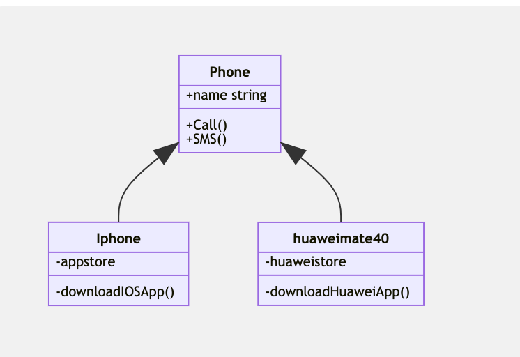
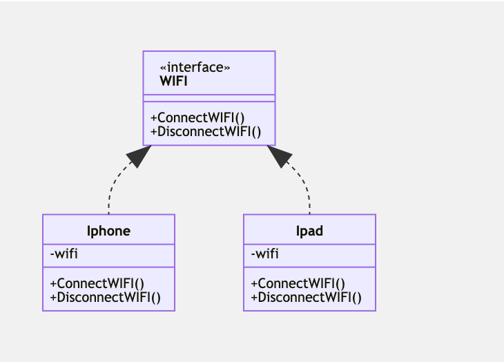
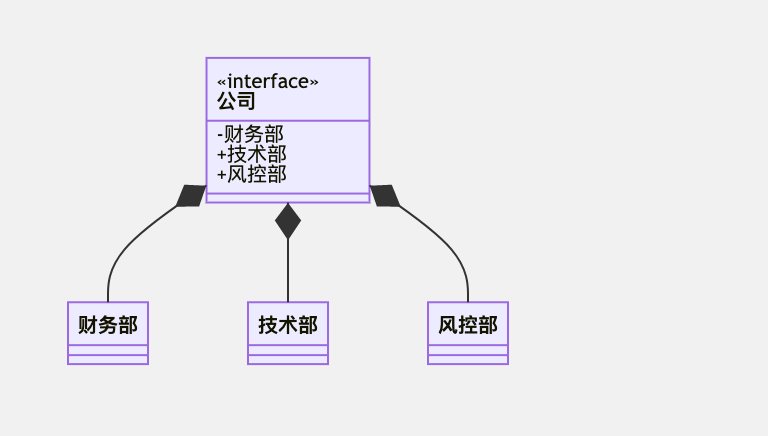
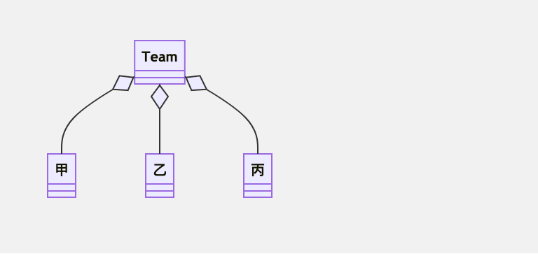
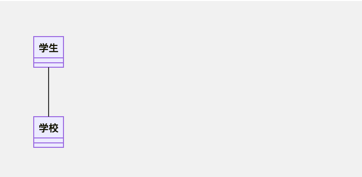
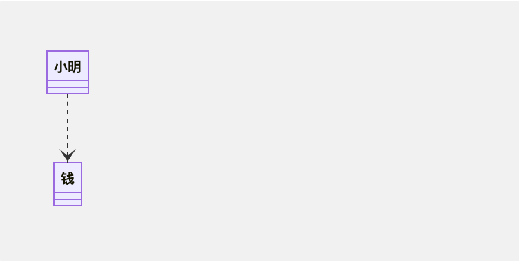

# 使用golang实现23中设计模式

## 学习并理解 23 种设计模式

> 设计模式 Design Pattern 是一套被反复使用、多数人知晓的、经过分类编目的、代码设计经验的总结，使用设计模式是为了可重用代码、让代码更容易被他人理解并且保证代码可靠性。

在《设计模式：可复用面向对象软件的基础》一书中所介绍的 23 种经典设计模式，不过设计模式并不仅仅只有这 23 种，随着软件开发行业的发展，越来越多的新模式不断诞生并得以应用。有经验的开发者在学习设计模式可以和过往的经验互相印证，更容易理解这些设计模式。
为什么要学习设计模式:

- 设计模式来源众多专家的经验和智慧，它们是从许多优秀的软件系统中总结出的成功的、能够实现可维护性复用的设计方案，使用这些方案将可以让我们避免做一些重复性的工作
- 设计模式提供了一套通用的设计词汇和一种通用的形式来方便开发人员之间沟通和交流，使得设计方案更加通俗易懂
- 大部分设计模式都兼顾了系统的可重用性和可扩展性，这使得我们可以更好地重用一些已有的设计方案、功能模块甚至一个完整的软件系统，避免我们经常做一些重复的设计、编写一些重复的代码
- 合理使用设计模式并对设计模式的使用情况进行文档化，将有助于别人更快地理解系统
- 学习设计模式将有助于初学者更加深入地理解面向对象思想

## UML 类图

每个模式都有相应的对象结构图，同时为了展示对象间的交互细节，有些时候会用到 UML 图来介绍其如何运行。这里不会将 UML 的各种元素都提到，只想讲讲类图中各个类之间的关系， 能看懂类图中各个类之间的线条、箭头代表什么意思后，也就足够应对日常的工作和交流。同时，我们应该能将类图所表达的含义和最终的代码对应起来。有了这些知识，看后面章节的设计模式结构图就没有什么问题了。

本文中大部分是 UML 类图，也有个别简易流程图。由于文中部分模式并未配图，你可以在这里查看我在网络上收集的完整 23 种设计模式 UML 类图。

### 继承

继承用一条带空心箭头的直接表示。

### 实现

实现关系用一条带空心箭头的虚线表示。

### 组合

与聚合关系一样，组合关系同样表示整体由部分构成的语义。比如公司由多个部门组成，但组合关系是一种强依赖的特殊聚合关系，如果整体不存在了，则部分也不存在了。例如，公司不存在了，部门也将不存在了。

### 聚合

聚合关系用于表示实体对象之间的关系，表示整体由部分构成的语义，例如一个部门由多个员工组成。与组合关系不同的是，整体和部分不是强依赖的，即使整体不存在了，部分仍然存在。例如，部门撤销了，人员不会消失，他们依然存在。

### 关联

关联关系是用一条直线表示的，它描述不同类的对象之间的结构关系，它是一种静态关系，通常与运行状态无关，一般由常识等因素决定的。它一般用来定义对象之间静态的、天然的结构， 所以，关联关系是一种“强关联”的关系。

比如，乘车人和车票之间就是一种关联关系，学生和学校就是一种关联关系，关联关系默认不强调方向，表示对象间相互知道。如果特别强调方向，如下图，表示 A 知道 B ，但 B 不知道 A 。

### 依赖

依赖关系是用一套带箭头的虚线表示的，如A依赖于B，他描述一个对象在运行期间会用到另一个对象的关系。

与关联关系不同的是，它是一种临时性的关系，通常在运行期间产生，并且随着运行时的变化，依赖关系也可能发生变化。显然，依赖也有方向，双向依赖是一种非常糟糕的结构，我们总是应该保持单向依赖，杜绝双向依赖的产生。

## 六大原则

### 开闭原则

> 一个软件实体应当对扩展开放，对修改关闭。即软件实体应尽量在不修改原有代码的情况下进行扩展。

任何软件都需要面临一个很重要的问题，即它们的需求会随时间的推移而发生变化。当软件系统需要面对新的需求时，我们应该尽量保证系统的设计框架是稳定的。如果一个软件设计符合开闭原则，那么可以非常方便地对系统进行扩展，而且在扩展时无须修改现有代码，使得软件系统在拥有适应性和灵活性的同时具备较好的稳定性和延续性。随着软件规模越来越大，软件寿命越来越长，软件维护成本越来越高，设计满足开闭原则的软件系统也变得越来越重要。

为了满足开闭原则，需要对系统进行抽象化设计，抽象化是开闭原则的关键。在 Java、C# 等编程语言中，可以为系统定义一个相对稳定的抽象层，而将不同的实现行为移至具体的实现层中完成。在很多面向对象编程语言中都提供了接口、抽象类等机制，可以通过它们定义系统的抽象层，再通过具体类来进行扩展。如果需要修改系统的行为，无须对抽象层进行任何改动，只需要增加新的具体类来实现新的业务功能即可，实现在不修改已有代码的基础上扩展系统的功能，达到开闭原则的要求。

优点：实践开闭原则的优点在于可以在不改动原有代码的前提下给程序扩展功能。增加了程序的可扩展性，同时也降低了程序的维护成本。

### 里氏替换原则

> 所有引用基类对象的地方能够透明地使用其子类的对象

里氏代换原则告诉我们，在软件中将一个基类对象替换成它的子类对象，程序将不会产生任何错误和异常，反过来则不成立，如果一个软件实体使用的是一个子类对象的话，那么它不一定能够使用基类对象。例如：我喜欢动物，那我一定喜欢狗，因为狗是动物的子类。但是我喜欢狗，不能据此断定我喜欢动物，因为我并不喜欢老鼠，虽然它也是动物。

例如有两个类，一个类为`BaseClass`，另一个是`SubClass`类，并且`SubClass`类是`BaseClass`类的子类，那么一个方法如果可以接受一个`BaseClass`类型的基类对象base的话，如：`method1(base)`，那么它必然可以接受一个`BaseClass`类型的子类对象`sub`，`method1(sub)`能够正常运行。反过来的代换不成立，如一个方法`method2`接受`BaseClass`类型的子类对象`sub`为参数：`method2(sub)`，那么一般而言不可以有`method2(base)`，除非是重载方法。

里氏代换原则是实现开闭原则的重要方式之一，由于使用基类对象的地方都可以使用子类对象，因此在程序中尽量使用基类类型来对对象进行定义，而在运行时再确定其子类类型，用子类对象来替换父类对象。

优点：可以检验继承使用的正确性，约束继承在使用上的泛滥。

### 依赖倒置原则

> 抽象不应该依赖于具体类，具体类应当依赖于抽象。换言之，要针对接口编程，而不是针对实现编程。

依赖倒转原则要求我们在程序代码中传递参数时或在关联关系中，尽量引用层次高的抽象层类，即使用接口和抽象类进行变量类型声明、参数类型声明、方法返回类型声明，以及数据类型的转换等，而不要用具体类来做这些事情。为了确保该原则的应用，一个具体类应当只实现接口或抽象类中声明过的方法，而不要给出多余的方法，否则将无法调用到在子类中增加的新方法。

在引入抽象层后，系统将具有很好的灵活性，在程序中尽量使用抽象层进行编程，而将具体类写在配置文件中，这样一来，如果系统行为发生变化，只需要对抽象层进行扩展，并修改配置文件，而无须修改原有系统的源代码，在不修改的情况下来扩展系统的功能，满足开闭原则的要求。

优点：通过抽象来搭建框架，建立类和类的关联，以减少类间的耦合性。而且以抽象搭建的系统要比以具体实现搭建的系统更加稳定，扩展性更高，同时也便于维护。

### 单一职责原则

> 一个类只负责一个功能领域中的相应职责，或者可以定义为：就一个类而言，应该只有一个引起它变化的原因。

单一职责原则告诉我们：一个类不能太“累”！在软件系统中，一个类（大到模块，小到方法）承担的职责越多，它被复用的可能性就越小，而且一个类承担的职责过多，就相当于将这些职责耦合在一起，当其中一个职责变化时，可能会影响其他职责的运作，因此要将这些职责进行分离，将不同的职责封装在不同的类中，即将不同的变化原因封装在不同的类中，如果多个职责总是同时发生改变则可将它们封装在同一类中。

单一职责原则是实现高内聚、低耦合的指导方针，它是最简单但又最难运用的原则，需要设计人员发现类的不同职责并将其分离，而发现类的多重职责需要设计人员具有较强的分析设计能力和相关实践经验。

优点：如果类与方法的职责划分得很清晰，不但可以提高代码的可读性，更实际性地更降低了程序出错的风险，因为清晰的代码会让 bug 无处藏身，也有利于 bug 的追踪，也就是降低了程序的维护成本。

### 迪米特法则（最少知道原则）

> 一个软件实体应当尽可能少地与其他实体发生相互作用

如果一个系统符合迪米特法则，那么当其中某一个模块发生修改时，就会尽量少地影响其他模块，扩展会相对容易，这是对软件实体之间通信的限制，迪米特法则要求限制软件实体之间通信的宽度和深度。迪米特法则可降低系统的耦合度，使类与类之间保持松散的耦合关系。

在将迪米特法则运用到系统设计中时，要注意下面的几点：在类的划分上，应当尽量创建松耦合的类，类之间的耦合度越低，就越有利于复用，一个处在松耦合中的类一旦被修改，不会对关联的类造成太大波及。在类的结构设计上，每一个类都应当尽量降低其成员变量和成员函数的访问权限。在类的设计上，只要有可能，一个类型应当设计成不变类。在对其他类的引用上，一个对象对其他对象的引用应当降到最低。

优点：实践迪米特法则可以良好地降低类与类之间的耦合，减少类与类之间的关联程度，让类与类之间的协作更加直接。

### 接口分离原则

> 使用多个专门的接口，而不使用单一的总接口，即客户端不应该依赖那些它不需要的接口。

根据接口隔离原则，当一个接口太大时，我们需要将它分割成一些更细小的接口，使用该接口的客户端仅需知道与之相关的方法即可。每一个接口应该承担一种相对独立的角色，不干不该干的事，该干的事都要干。

在使用接口隔离原则时，我们需要注意控制接口的粒度，接口不能太小，如果太小会导致系统中接口泛滥，不利于维护。接口也不能太大，太大的接口将违背接口隔离原则，灵活性较差，使用起来很不方便。

优点：避免同一个接口里面包含不同类职责的方法，接口责任划分更加明确，符合高内聚低耦合的思想。

### 六大原则 - 学习心得

六大原则中，开闭原则、里氏替换原则、依赖倒置原则 联系比较紧密，后两者是实现开闭原则重要前提，使用中通过抽象化设计具有很好的可拓展性和可维护性。

知道最少原则 可以降低耦合，减少不必要的交互，主张设计接口和类要简单易使用，将复杂的逻辑封装并提供简单易用的接口。

单一职责原则 使项目中的类和方法根据职责细分，避免单个类负担过重。职责越多，被复用的可能性就越小或使用起来越麻烦。

接口分离原则 将功能复杂的接口细分成多个特定功能的接口，只做该做的事情，降低耦合，但是细化粒度不能太细，容易导致接口过多。单一职责原则强调单个类内部根据职责细分的设计，接口分离原则强调类之间的耦合，尽量建立最小的依赖关系。

## 模式分类

《设计模式：可复用面向对象软件的基础》一书中设计模式有23个，它们各具特色，每个模式都为某一个可重复的设计问题提供了一套解决方案。

根据它们的用途，设计模式可分为

- 创建型(Creational)
- 结构型(Structural)
- 行为型(Behavioral)三种，

其中创建型模式主要用于描述如何创建对象，结构型模式主要用于描述如何实现类或对象的组合，行为型模式主要用于描述类或对象怎样交互以及怎样分配职责。

此外，根据某个模式主要是用于处理类之间的关系还是对象之间的关系，设计模式还可以分为类模式和对象模式。我们经常将两种分类方式结合使用，如单例模式是对象创建型模式，模板方法模式是类行为型模式。

### 创建型(Creational)

创建型模式(Creational Pattern)对类的实例化过程进行了抽象，能够将模块中对象的创建和对象的使用分离。为了使结构更加清晰，外界对于这些对象只需要知道它们共同的接口，而不清楚其具体的实现细节，使整个系统的设计更加符合单一职责原则。

- [简单工厂模式（Simple Factory Pattern）](creational/simple_factory)
- [工厂方法模式（Factory Method Pattern）](creational/factory)
- [抽象工厂模式（Abstract Factory Pattern）](creational/abstract_factory)
- [单例模式（Singleton Pattern）](creational/simple_factory)
- [生成器模式（Builder Pattern）](creational/builder)
- [原型模式（Prototype Pattern)](creational/prototype)

### 结构型(Structural)

结构型模式(Structural Pattern)描述如何将类或者对象结合在一起形成更大的结构，就像搭积木，可以通过简单积木的组合形成复杂的、功能更为强大的结构。结构型模式可以分为类结构型模式和对象结构型模式：

类结构型模式关心类的组合，由多个类可以组合成一个更大的系统，在类结构型模式中一般只存在继承关系和实现关系。

对象结构型模式关心类与对象的组合，通过关联关系使得在一个类中定义另一个类的实例对象，然后通过该对象调用其方法。根据“合成复用原则”，在系统中尽量使用关联关系来替代继承关系，因此大部分结构型模式都是对象结构型模式。

- [装饰者模式](structural/decorator)
- [外观模式](structural/facade)
- [代理模式](structural/proxy)
- [享元模式](structural/flyweight)
- [桥接模式](structural/bridage)
- [适配器模式](structural/adapter)
- [组合模式](structural/composite)

### 行为型(Behavioral)

行为型模式(Behavioral Pattern)是对在不同的对象之间划分责任和算法的抽象化。行为型模式不仅仅关注类和对象的结构，而且重点关注它们之间的相互作用。通过行为型模式，可以更加清晰地划分类与对象的职责，并研究系统在运行时实例对象之间的交互。

- [职责链模式](behavioral/responsibility_chain)
- [命令模式](behavioral/command)
- 解释器模式
- 迭代器模式
- 中介者模式
- 备忘录模式
- 观察者模式
- 状态模式
- 策略模式
- 模板方法模式
- 访问者模式

## 行为型模式概述

- 命令模式
- 策略模式

- 解释器模式
- 状态模式
- 观察者模式
- 模板方法模式
- 迭代器模式
- 中介者模式  
- 备忘录模式
- 访问者模式
