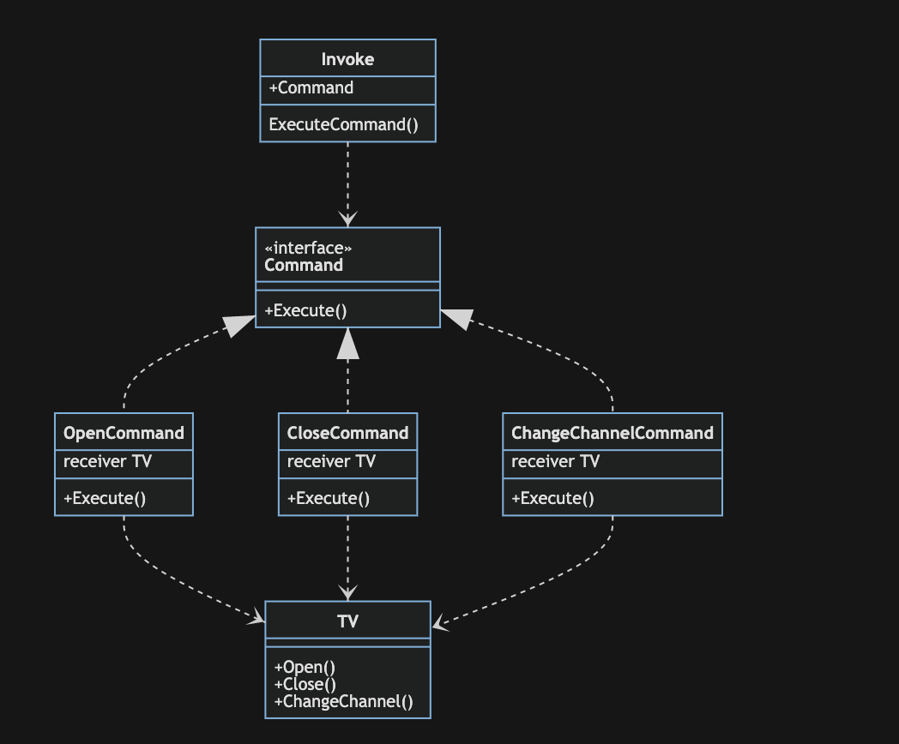

# 命令模式

> 命令模式(Command Pattern)：将一个请求封装为一个对象，从而让我们可用不同的请求对客户进行参数化；对请求排队或者记录请求日志，以及支持可撤销的操作。命令模式是一种对象行为型模式，其别名为动作(Action)模式或事务(Transaction)模式。

模式动机:

命令模式可以将发送者和接收者完全解耦，发送者与接收者之间没有直接引用关系，发送请求的对象只需要知道如何发送请求，而不必知道如何完成请求。

命令模式包含以下四个角色：

- Receiver(接收者): 接收者执行与请求相关的操作，它具体实现对请求的业务处理。
- Invoker(调用者)：请求发送者，通过命令对象来执行请求。
- Command(抽象命令类)：一个抽象类或接口，声明了执行请求的Execute()方法，通过这些方法可以调用请求接收者的相关操作
- ConcreteCommand(具体命令类)：具体命令类是抽象命令类的子类，实现了抽象命令类中声明的方法。在实现Execute()方法时，将调用接收者对象的相关操作(Action)

## 优点

- 降低系统的耦合度。由于请求者与接收者之间不存在直接引用，因此请求者与接收者之间实现完全解耦，相同的请求者可以对应不同的接收者，同样，相同的接收者也可以供不同的请求者使用，两者之间具有良好的独立性。
- 新的命令可以很容易地加入到系统中。由于增加新的具体命令类不会影响到其他类，因此增加新的具体命令类很容易，无须修改原有系统源代码，甚至客户类代码，满足“开闭原则”的要求。
- 可以比较容易地设计一个命令队列或宏命令（组合命令）。
- 为请求的撤销(Undo)和恢复(Redo)操作提供了一种设计和实现方案。

## 缺点

- 使用命令模式可能会导致某些系统有过多的具体命令类。因为针对每一个对请求接收者的调用操作都需要设计一个具体命令类，因此在某些系统中可能需要提供大量的具体命令类，这将影响命令模式的使用。
