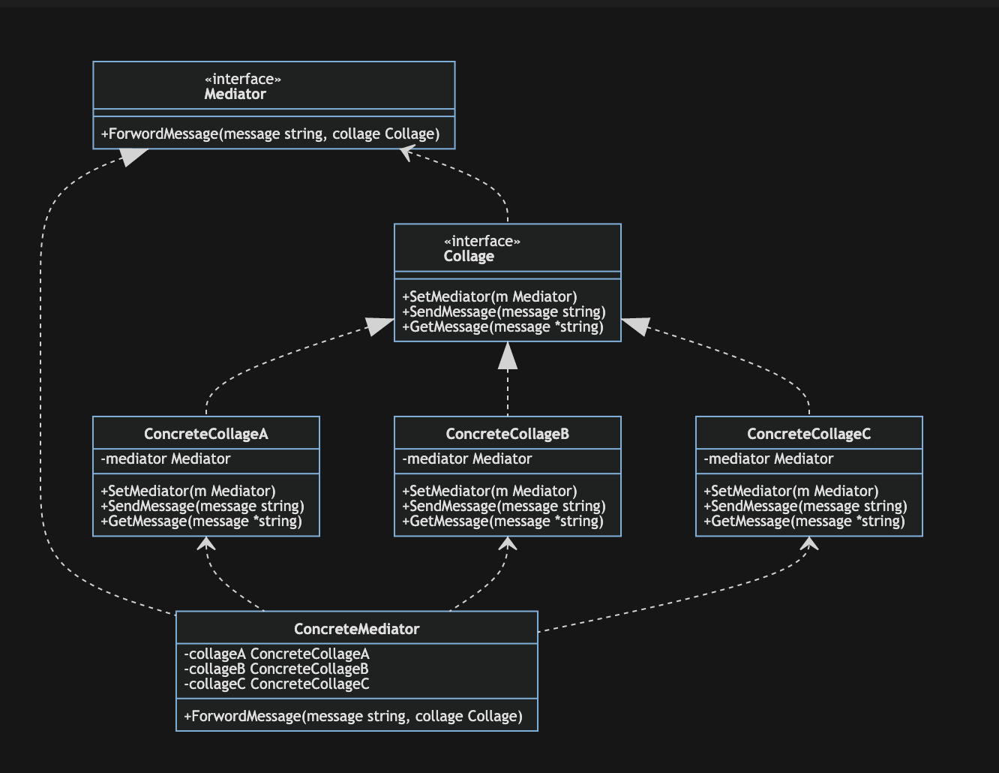
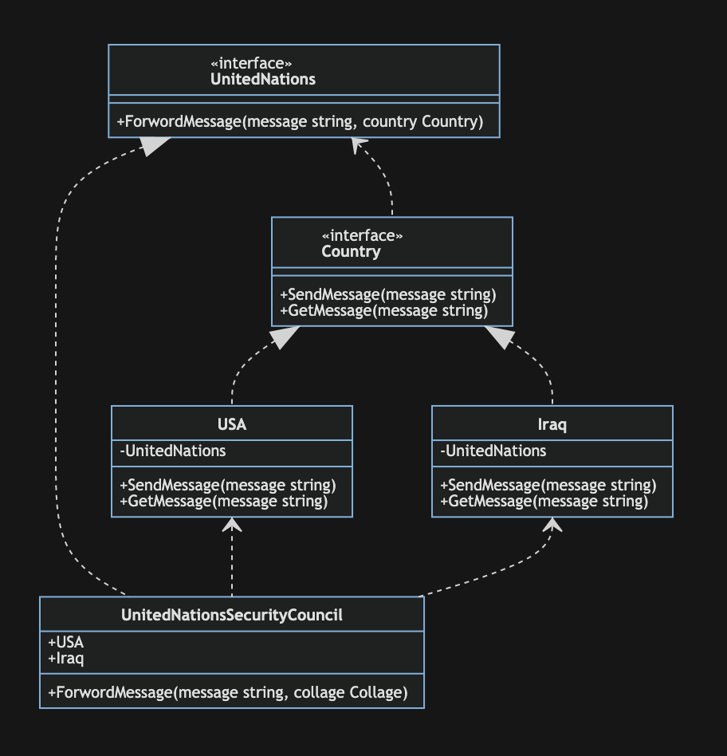

# 中介者模式

中介者模式(Mediator Pattern)：用一个中介对象（中介者）来封装一系列的对象交互，中介者使各对象不需要显式地相互引用，从而使其耦合松散，而且可以独立地改变它们之间的交互。中介者模式又称为调停者模式，它是一种对象行为型模式。

模式动机：

对于一个模块，可能由很多对象构成，而且这些对象之间可能存在相互的引用，为了减少对象两两之间复杂的引用关系，使之称为一个松耦合的系统，这就是中介者模式的模式动机

中介者模式包含以下四个角色：

- Mediator(抽象中介者)：它定义了一个接口，该接口用于与各同事对象之间进行通信。
- ConcreteMediator(具体中介者)：它实现了接口，通过协调各个同事对象来实现协作行为，维持各个同事对象的引用
- Colleague(抽象同事类)：它定义了各个同事类公有的方法，并声明了一些抽象方法来供子类实现，同时维持了一个对抽象中介者类的引用，其子类可以通过该引用来与中介者通信。
- ConcreteColleague(具体同事类)：抽象同事类的子类，每一个同事对象需要和其他对象通信时，都需要先与中介者对象通信，通过中介者来间接完成与其他同事类的通信

## 优点

- 中介者模式简化了对象之间的交互，它用中介者和同事的一对多交互代替了原来同事之间的多对多交互，一对多关系更容易理解、维护和扩展，将原本难以理解的网状结构转换成相对简单的星型结构。
- 中介者模式可将各同事对象解耦。中介者有利于各同事之间的松耦合，我们可以独立的改变和复用每一个同事和中介者，增加新的中介者和新的同事类都比较方便，更好地符合“开闭原则”。
- 可以减少子类生成，中介者将原本分布于多个对象间的行为集中在一起，改变这些行为只需生成新的中介者子类即可，这使各个同事类可被重用，无须对同事类进行扩展。

缺点：

- 在具体中介者类中包含了大量同事之间的交互细节，可能会导致具体中介者类非常复杂，使得系统难以维护。
