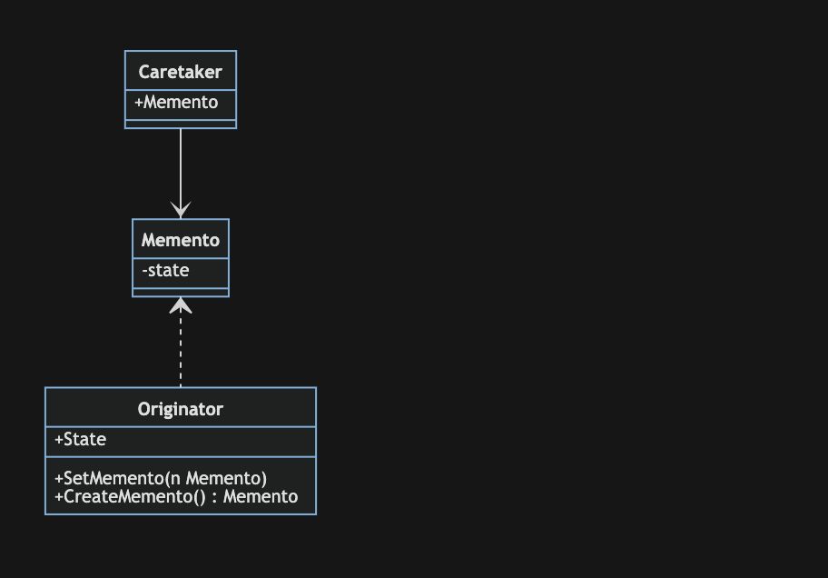

# 备忘录模式

备忘录模式(Memento Pattern)：在不破坏封装的前提下，捕获一个对象的内部状态，并在该对象之外保存这个状态，这样可以在以后将对象恢复到原先保存的状态。它是一种对象行为型模式，其别名为Token。

备忘录模式包含三个角色：

- Originator(发起人):负责创建一个备忘录Memento，用以记录当前时刻它的内部状态，并可以使用备忘录恢复内部状态。Originator可根据需要决定Memento存储Originator的那些内部状态
- Memento(备忘录)：负责存储Originator对象的内部状态，并可防止Originator以外的其他对象访问备忘录Memento。
- Caretaker(管理者)：负责保存好备忘录Memento，不能对备忘录的内容进行操作或检查。

## 举例

备忘录模式提供了一种状态恢复的实现机制，使得用户可以方便地回到一个特定的历史步骤，当新的状态无效或者存在问题时，可以使用暂时存储起来的备忘录将状态复原，当前很多软件都提供了撤销操作，其中就使用了备忘录模式。
我们用一个简单的游戏存档来举例，这也是备忘录模式的一种应用。

## 优点

- 它提供了一种状态恢复的实现机制，使得用户可以方便地回到一个特定的历史步骤，当新的状态无效或者存在问题时，可以使用暂时存储起来的备忘录将状态复原。
- 备忘录实现了对信息的封装，一个备忘录对象是一种原发器对象状态的表示，不会被其他代码所改动。备忘录保存了原发器的状态，采用列表、堆栈等集合来存储备忘录对象可以实现多次撤销操作。

## 缺点

- 资源消耗过大，如果需要保存的原发器类的成员变量太多，就不可避免需要占用大量的存储空间，每保存一次对象的状态都需要消耗一定的系统资源。
