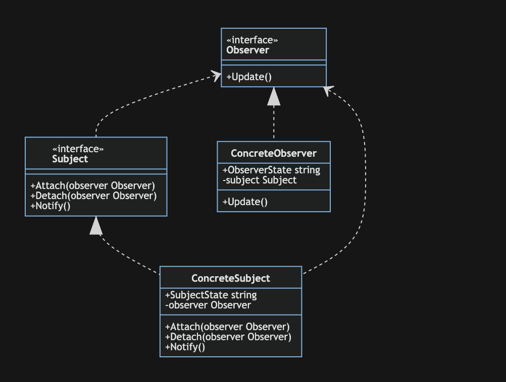
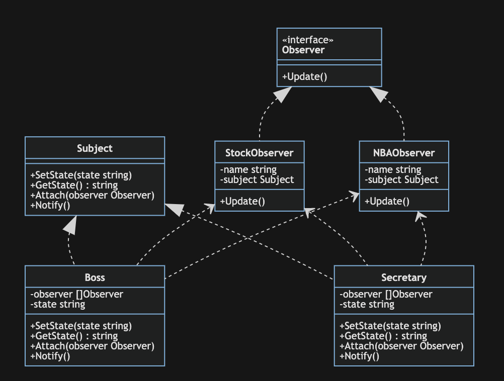

# 观察者模式

> 观察者模式(Observer Pattern)：定义对象之间的一种一对多依赖关系，使得每当一个对象状态发生改变时，其相关依赖对象皆得到通知并被自动更新。观察者模式的别名包括发布-订阅（Publish/Subscribe）模式、模型-视图（Model/View）模式、源-监听器（Source/Listener）模式或从属者（Dependents）模式。观察者模式是一种对象行为型模式。

观察者模式包含四个角色：

- Subject(抽象目标)：又称为主题，是被观察的对象
- ConcreteSubject(具体目标)：抽象目标的子类，通常包含有经常发生改变的数据，当它的状态发生改变时，向其各个观察者发出通知
- Observer(抽象观察者)：观察者将对观察目标的改变做出反应
- ConcreteObserver(具体观察者)：具体观察者中维持一个指向具体目标对象的引用，它用于存储具体观察者的有关状态，这些状态和具体目标的状态保持一致

## 举例

观察者模式是使用频率最高的设计模式之一，它用于建立一种对象与对象之间的依赖关系，一个对象发生改变时将自动通知其他对象，其他对象将相应作出反应。

我们下面以上班(在上班的时候有些同事会看股票行情，有些还会看NBA，老板则偶尔会走动，前台秘书和同事的关系比较好，等老板出来走动的时候，她会通知每位同事)为例，其UML类图如下：

## 优点

- 观察者模式可以实现表示层和数据逻辑层的分离，定义了稳定的消息更新传递机制，并抽象了更新接口，使得可以有各种各样不同的表示层充当具体观察者角色。
- 观察者模式在观察目标和观察者之间建立一个抽象的耦合。观察目标只需要维持一个抽象观察者的集合，无须了解其具体观察者。由于观察目标和观察者没有紧密地耦合在一起，因此它们可以属于不同的抽象化层次。
- 观察者模式支持广播通信，观察目标会向所有已注册的观察者对象发送通知，简化了一对多系统设计的难度。
- 观察者模式满足“开闭原则”的要求，增加新的具体观察者无须修改原有系统代码，在具体观察者与观察目标之间不存在关联关系的情况下，增加新的观察目标也很方便。

## 缺点

- 如果一个观察目标对象有很多直接和间接观察者，将所有的观察者都通知到会花费很多时间。
- 如果在观察者和观察目标之间存在循环依赖，观察目标会触发它们之间进行循环调用，可能导致系统崩溃。
- 观察者模式没有相应的机制让观察者知道所观察的目标对象是怎么发生变化的，而仅仅只是知道观察目标发生了变化。
