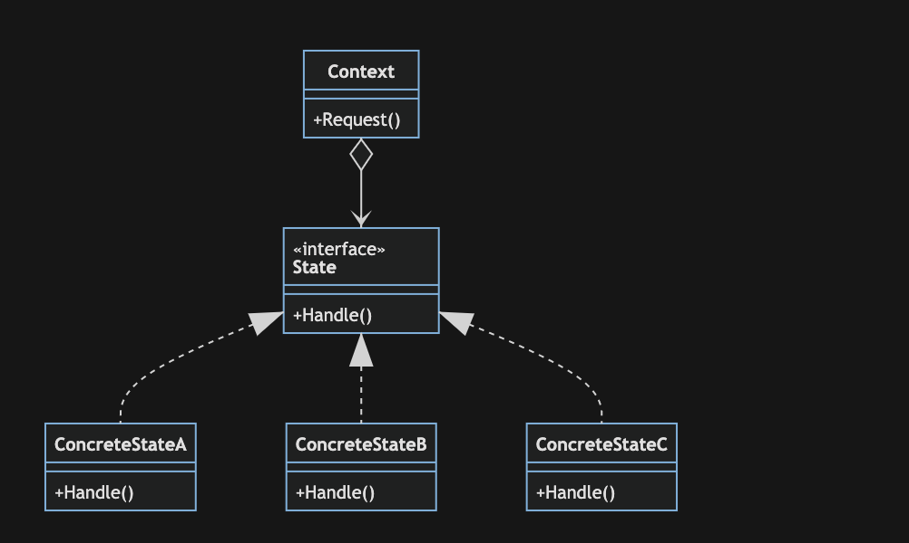

# 状态模式

> 状态模式(State Pattern)：允许一个对象在其内部状态改变时改变它的行为，对象看起来似乎修改了它的类。其别名为状态对象(Objects for States)，状态模式是一种对象行为型模式。

模式动机：

当控制一个对象状态转换的条件表达式过于复杂时，将状态的判断逻辑转移道表示不同状态的一系列类当中，可以把复杂的判断逻辑简化。

状态模式包含如下几个角色：

- Context(环境类):维护一个ConcreteState子类的实例，这个实例定义当前的状态
- State(抽象状态类):定义一个接口以封装与Context的一个特定状态相关的行为
- ConcreteState(具体状态类):每一个子类实现一个与Context的一个状态相关的行为

下面以我们工作的状态(随着时间的变化，我们的工装状态是会不断变化的)为例，其UML类图如下：

## 优点

- 封装了状态的转换规则，在状态模式中可以将状态的转换代码封装在环境类或者具体状态类中，可以对状态转换代码进行集中管理，而不是分散在一个个业务方法中。
- 将所有与某个状态有关的行为放到一个类中，只需要注入一个不同的状态对象即可使环境对象拥有不同的行为。
- 允许状态转换逻辑与状态对象合成一体，而不是提供一个巨大的条件语句块，状态模式可以让我们避免使用庞大的条件语句来将业务方法和状态转换代码交织在一起。
- 可以让多个环境对象共享一个状态对象，从而减少系统中对象的个数。

## 缺点

- 状态模式的使用必然会增加系统中类和对象的个数，导致系统运行开销增大。
- 状态模式的结构与实现都较为复杂，如果使用不当将导致程序结构和代码的混乱，增加系统设计的难度。
- 状态模式对“开闭原则”的支持并不太好，增加新的状态类需要修改那些负责状态转换的源代码，否则无法转换到新增状态；而且修改某个状态类的行为也需修改对应类的源代码。
