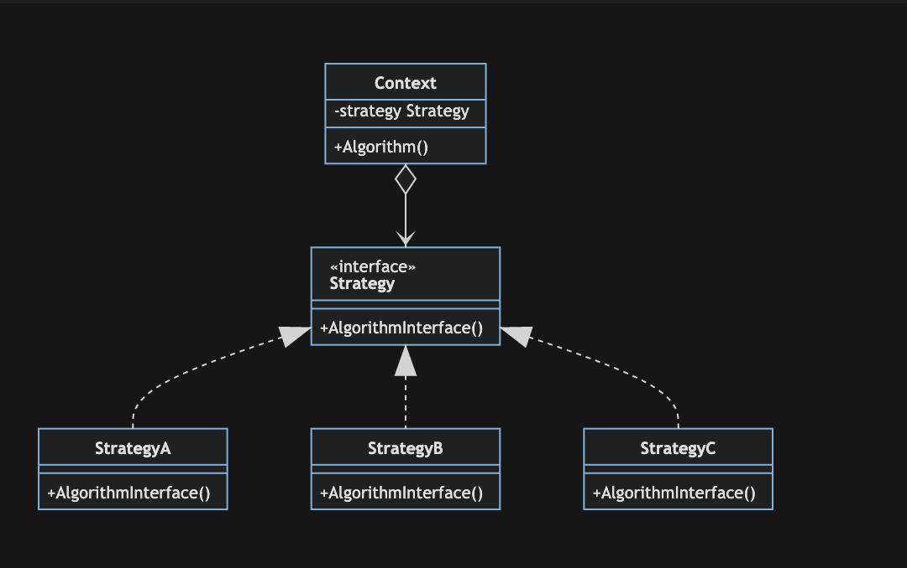

# 策略模式

策略模式(Strategy Pattern)：定义一系列算法类，将每一个算法封装起来，并让它们可以相互替换，策略模式让算法独立于使用它的客户而变化，也称为政策模式(Policy)。策略模式是一种对象行为型模式

模式动机：

为了解决在有多种算法相似的情况下，使用if…else所带来的复杂和难以维护性，这样定义一系列的算法，把它们一个个封装起来，并且使它们相互替换。
策略模式包含以下几个角色：

- Context(环境类):负责使用算法策略，其中维持了一个抽象策略类的引用实例
- Strategy(抽象策略类)：所有策略类的父类，为所支持的策略算法声明了抽象方法，可以为接口
- ConcreteStrategy(具体策略类)：实现了在抽象策略类中声明的方法

## 举例

使用策略模式时，我们可以定义一些策略类，每一个策略类中封装一种具体的算法。在这里，每一个封装算法的类我们都可以称之为一种策略，根据传入不同的策略类，使环境类执行不同策略类中的算法。

生活中也有很多类似的例子，就比如说商城的会员卡机制。我们去商城购物可以通过持有的会员卡打折，购买同一件商品时，持有不同等级的会员卡，能得到不同力度的折扣。下面的例子中我列举了青铜、白银、黄金三种 Vip 会员卡，传入不同的会员卡最终需要支付的金额也会有所不同。

## 优点

- 策略模式提供了对“开闭原则”的完美支持，用户可以在不修改原有系统的基础上选择算法或行为，也可以灵活地增加新的算法或行为。
- 策略模式提供了管理相关的算法族的办法。策略类的等级结构定义了一个算法或行为族，恰当使用继承可以把公共的代码移到抽象策略类中，从而避免重复的代码。
- 策略模式提供了一种可以替换继承关系的办法。如果不使用策略模式，那么使用算法的环境类就可能会有一些子类，每一个子类提供一种不同的算法。但是，这样一来算法的使用就和算法本身混在一起，不符合“单一职责原则”，决定使用哪一种算法的逻辑和该算法本身混合在一起，从而不可能再独立演化；而且使用继承无法实现算法或行为在程序运行时的动态切换。
- 使用策略模式可以避免多重条件选择语句。多重条件选择语句不易维护，它把采取哪一种算法或行为的逻辑与算法或行为本身的实现逻辑混合在一起，将它们全部硬编码(Hard Coding)在一个庞大的多重条件选择语句中，比直接继承环境类的办法还要原始和落后。
- 策略模式提供了一种算法的复用机制，由于将算法单独提取出来封装在策略类中，因此不同的环境类可以方便地复用这些策略类。

## 缺点

- 客户端必须知道所有的策略类，并自行决定使用哪一个策略类。这就意味着客户端必须理解这些算法的区别，以便适时选择恰当的算法。换言之，策略模式只适用于客户端知道所有的算法或行为的情况。
- 策略模式将造成系统产生很多具体策略类，任何细小的变化都将导致系统要增加一个新的具体策略类。
- 无法同时在客户端使用多个策略类，也就是说，在使用策略模式时，客户端每次只能使用一个策略类，不支持使用一个策略类完成部分功能后再使用另一个策略类来完成剩余功能的情况。
