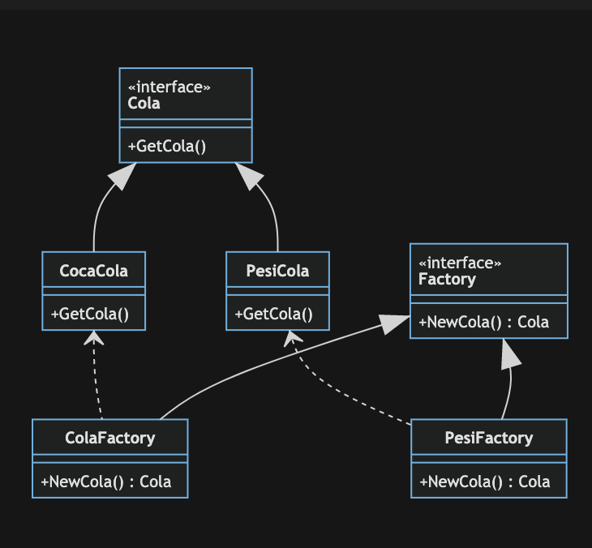

# 工厂方法模式

工厂方法模式(Factory Method Pattern)又称为工厂模式，工厂父类负责定义创建产品对象的公共接口，而工厂子类则负责生成具体的产品对象，即通过不同的工厂子类来创建不同的产品对象。

## 举例

工厂方法和简单工厂有一些区别，简单工厂是由一个代工厂生产不同的产品，而工厂方法是对工厂进行抽象化，不同产品都由专门的具体工厂来生产。可口可乐工厂专门生产可口可乐，百事可乐工厂专门生产百事可乐。

## 优点

用户只需要关心其所需产品对应的具体工厂是哪一个即可，不需要关心产品的创建细节，也不需要知道具体产品类的类名。
当系统中加入新产品时，不需要修改抽象工厂和抽象产品提供的接口，也无须修改客户端和其他的具体工厂和具体产品，而只要添加一个具体工厂和与其对应的具体产品就可以了，符合了开闭原则。

## 缺点

当系统中加入新产品时，除了需要提供新的产品类之外，还要提供与其对应的具体工厂类。因此系统中类的个数将成对增加，增加了系统的复杂度。
