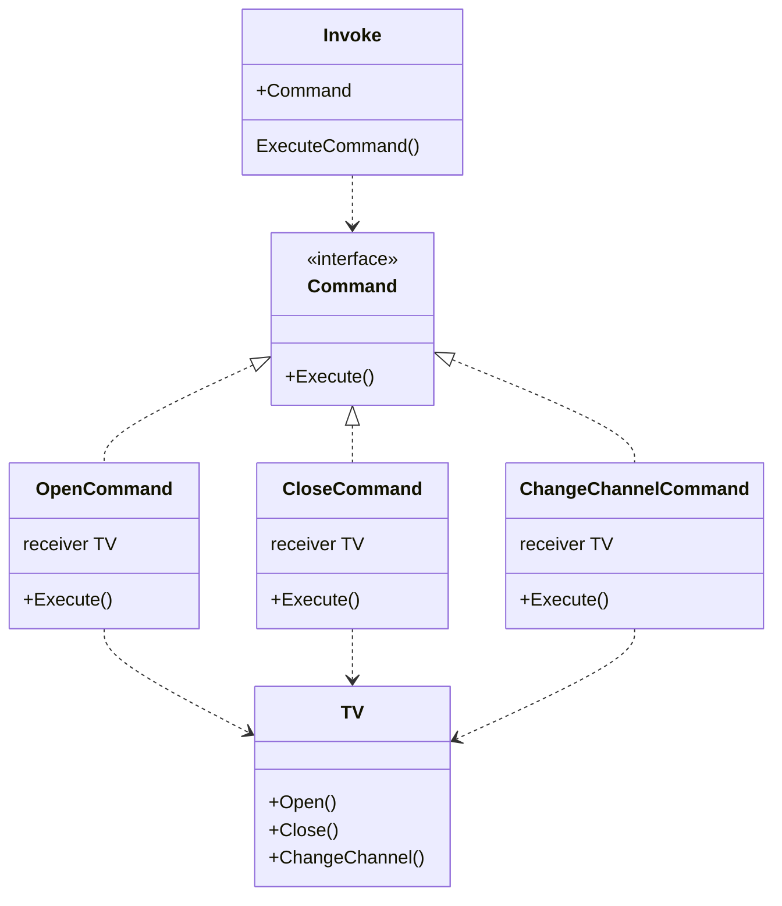

# 命令模式

```mermaid
classDiagram
    Command <|.. OpenCommand
    Command <|.. CloseCommand
    Command <|.. ChangeChannelCommand
    OpenCommand ..> TV
    CloseCommand ..> TV
    ChangeChannelCommand ..> TV
    Invoke ..> Command
    class TV{
        +Open()
        +Close()
        +ChangeChannel()
    }
    class Command{
        <<interface>>
        +Execute()
    }
    class OpenCommand{
        receiver TV
        +Execute()
    }
    class CloseCommand{
        receiver TV
        +Execute()
    }
    class ChangeChannelCommand{
        receiver TV
        +Execute()
    }
    class Invoke{
        +Command
        ExecuteCommand()
    }
```
