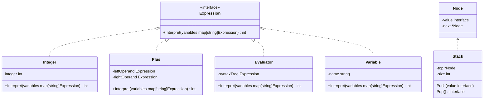

# 解释器模式

```mermaid
classDiagram
    Expression <|.. Integer
    Expression <|.. Plus
    Expression <|.. Evaluator
    Expression <|.. Variable
    Node <.. Stack
    class Expression{
        <<interface>>
        +Interpret(variables map[string]Expression) int
    }
    class Integer{
        integer int
        +Interpret(variables map[string]Expression) int
    }
    class Plus{
        -leftOperand  Expression
        -rightOperand Expression
        +Interpret(variables map[string]Expression) int
    }
    class Evaluator {
        -syntaxTree Expression
        +Interpret(variables map[string]Expression) int
    }
    class Variable{
        -name string
        +Interpret(variables map[string]Expression) int
    }
    class Node{
        -value interface
        -next *Node
    }
    class Stack{
        -top  *Node
        -size int
        Push(value interface)
        Pop() interface
    }
```
