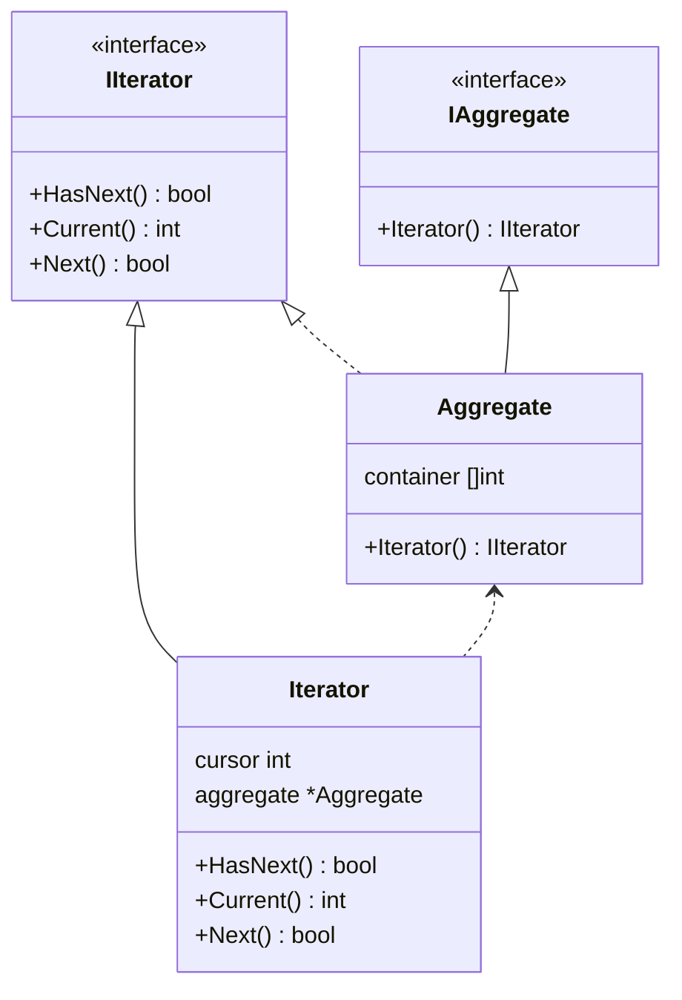

# 迭代器模式

```mermaid
classDiagram
    IIterator <|-- Iterator
    IAggregate <|-- Aggregate
    IIterator <|.. Aggregate
    Aggregate <.. Iterator
    class IIterator{
        <<interface>>
        +HasNext() bool
        +Current() int
        +Next() bool
    }
    class Iterator{
        cursor int
        aggregate *Aggregate
        +HasNext() bool
        +Current() int
        +Next() bool
    }
    class IAggregate{
        <<interface>>
        +Iterator() IIterator
    }
    class Aggregate {
        container []int
        +Iterator() IIterator
    }
```
