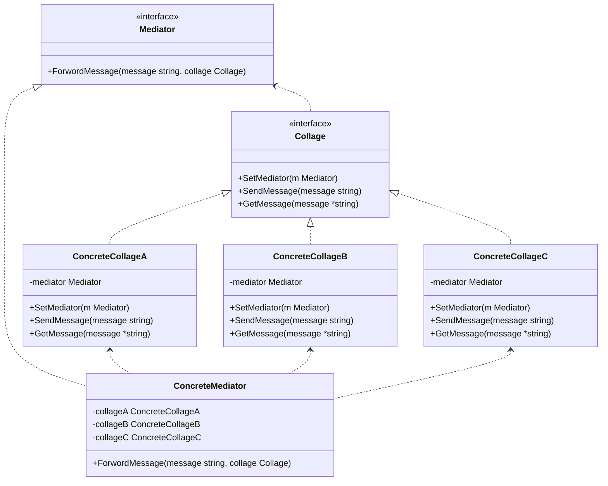

# 中介者模式

```mermaid
classDiagram
    Mediator <|.. ConcreteMediator
    Collage <|.. ConcreteCollageA
    Collage <|.. ConcreteCollageB
    Collage <|.. ConcreteCollageC
    ConcreteCollageA <.. ConcreteMediator
    ConcreteCollageB <.. ConcreteMediator
    ConcreteCollageC <.. ConcreteMediator
    Mediator <.. Collage
    class Mediator{
        <<interface>>
        +ForwordMessage(message string, collage Collage)
    }
    class ConcreteMediator{
        -collageA ConcreteCollageA
        -collageB ConcreteCollageB
        -collageC ConcreteCollageC
        +ForwordMessage(message string, collage Collage)
    }
    class Collage{
        <<interface>>
        +SetMediator(m Mediator)
        +SendMessage(message string)
        +GetMessage(message *string)
    }
    class ConcreteCollageA{
        -mediator Mediator
        +SetMediator(m Mediator)
        +SendMessage(message string)
        +GetMessage(message *string)
    }
    class ConcreteCollageB{
        -mediator Mediator
        +SetMediator(m Mediator)
        +SendMessage(message string)
        +GetMessage(message *string)
    }
    class ConcreteCollageC{
        -mediator Mediator
        +SetMediator(m Mediator)
        +SendMessage(message string)
        +GetMessage(message *string)
    }
```
