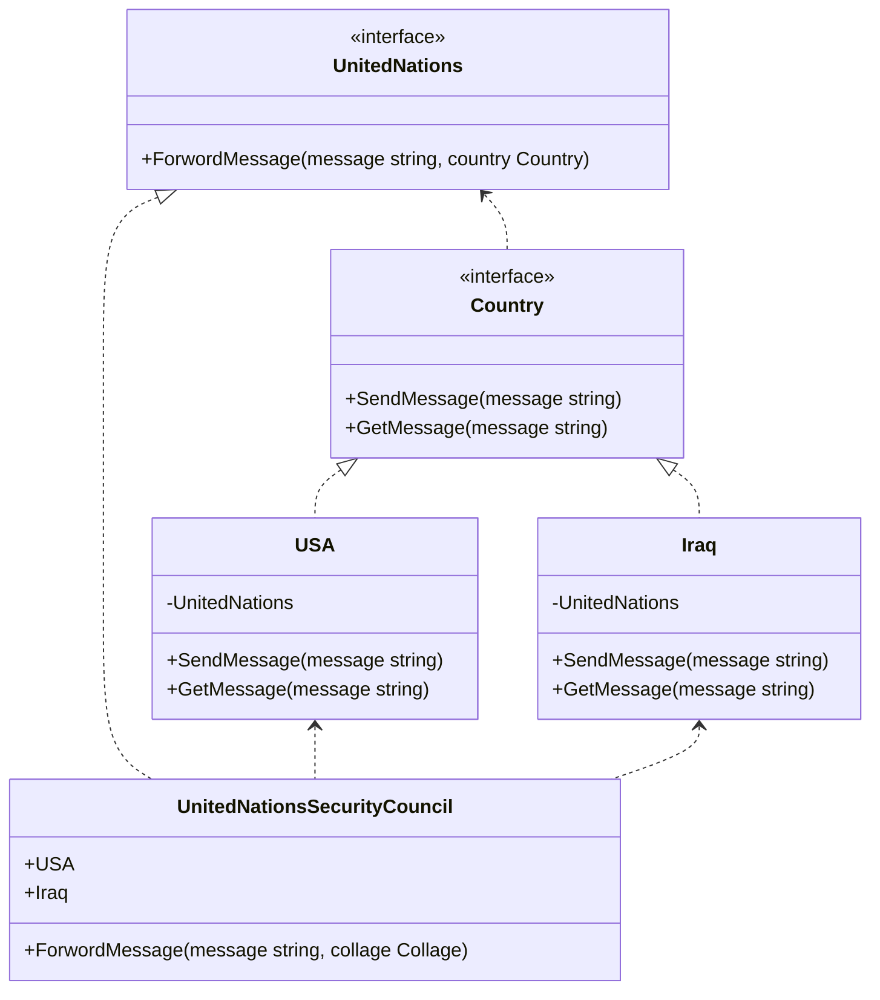

# 中介者模式

```mermaid
classDiagram
    UnitedNations <|.. UnitedNationsSecurityCouncil
    Country <|.. USA
    Country <|.. Iraq
    USA <.. UnitedNationsSecurityCouncil
    Iraq <.. UnitedNationsSecurityCouncil
    UnitedNations <.. Country
    class UnitedNations{
        <<interface>>
        +ForwordMessage(message string, country Country)
    }
    class UnitedNationsSecurityCouncil{
        +USA
        +Iraq
        +ForwordMessage(message string, collage Collage)
    }
    class Country{
        <<interface>>
        +SendMessage(message string)
        +GetMessage(message string)
    }
    class USA{
        -UnitedNations
        +SendMessage(message string)
        +GetMessage(message string)
    }
    class Iraq{
        -UnitedNations
        +SendMessage(message string)
        +GetMessage(message string)
    }
```
