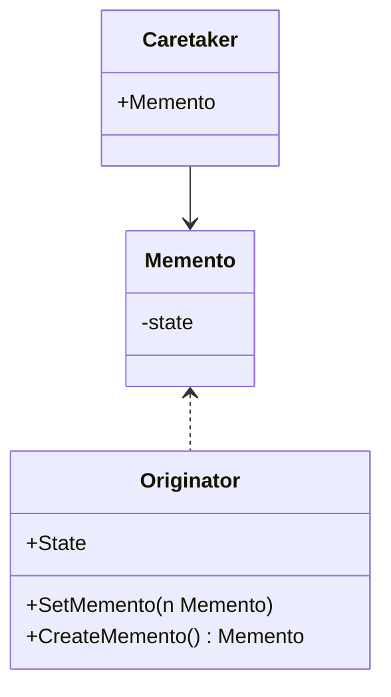

# 备忘录模式

```mermaid
classDiagram
    Caretaker --> Memento
    Memento <.. Originator
    class Caretaker{
        +Memento
    }
    class Memento{
        -state
    }
    class Originator{
        +State
        +SetMemento(n Memento)
        +CreateMemento() Memento
    }
```
