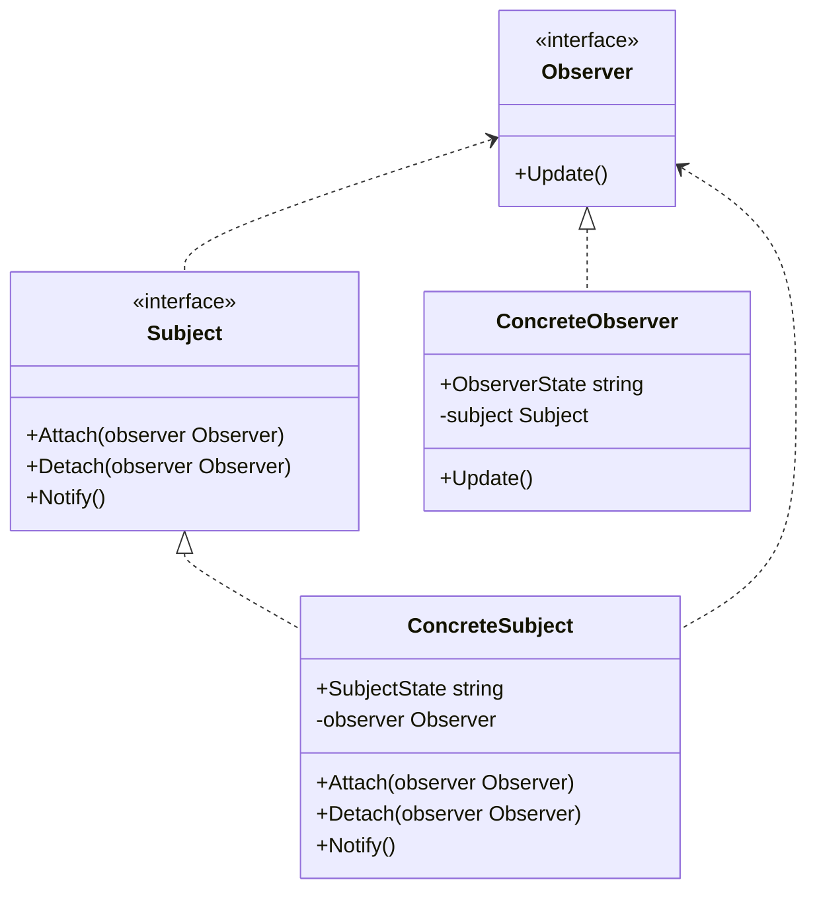

# 观察者模式

```mermaid
classDiagram
    Subject <|.. ConcreteSubject
    Observer <|.. ConcreteObserver
    Observer <.. Subject
    Observer <.. ConcreteSubject
    class Subject{
        <<interface>>
        +Attach(observer Observer)
        +Detach(observer Observer)
        +Notify()
    }
    class Observer{
        <<interface>>
        +Update()
    }
    class ConcreteSubject{
        +SubjectState string
        -observer Observer
        +Attach(observer Observer)
        +Detach(observer Observer)
        +Notify()
    }
    class ConcreteObserver{
        +ObserverState string
        -subject Subject
        +Update()
    }
```
