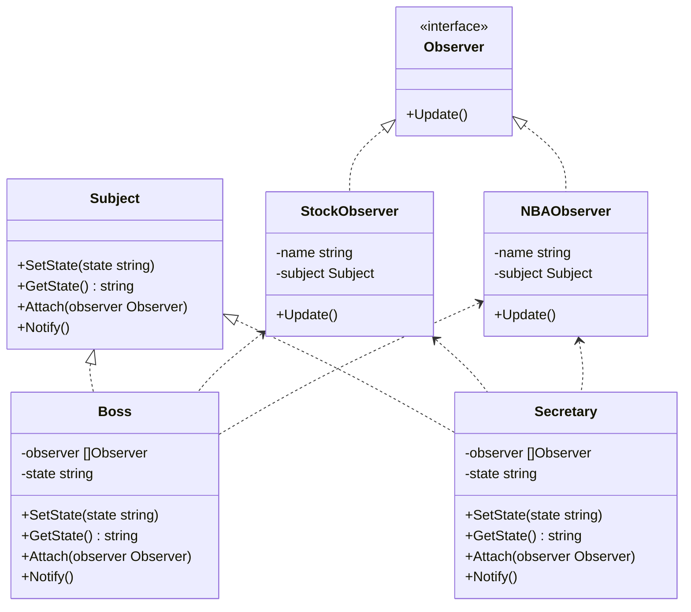

# 观察者模式

```mermaid
classDiagram
    Observer <|.. StockObserver
    Observer <|.. NBAObserver
    Subject <|.. Boss
    Subject <|.. Secretary
    StockObserver <.. Boss
    StockObserver <.. Secretary
    NBAObserver <.. Boss
    NBAObserver <.. Secretary
    class Observer{
        <<interface>>
        +Update()
    }
    class StockObserver{
        -name    string
        -subject Subject
        +Update()
    }
    class NBAObserver{
        -name    string
        -subject Subject
        +Update()
    }
    class Subject {
        +SetState(state string)
        +GetState() string
        +Attach(observer Observer)
        +Notify()
    }
    class Boss{
        -observer []Observer
        -state    string
        +SetState(state string)
        +GetState() string
        +Attach(observer Observer)
        +Notify()
    }
    class Secretary{
        -observer []Observer
        -state    string
        +SetState(state string)
        +GetState() string
        +Attach(observer Observer)
        +Notify()
    }
```
