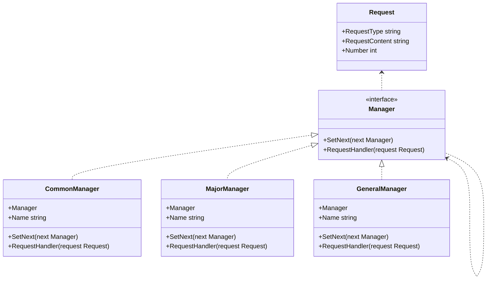

# 职责链模式

```mermaid
classDiagram
    Request <.. Manager
    Manager <.. Manager
    Manager <|.. CommonManager
    Manager <|.. MajorManager
    Manager <|.. GeneralManager
    class Request{
        +RequestType    string
        +RequestContent string
        +Number         int
    }
    class Manager{
        <<interface>>
        +SetNext(next Manager)
        +RequestHandler(request Request)
    }
    class CommonManager{
        +Manager
        +Name string
        +SetNext(next Manager)
        +RequestHandler(request Request)
    }
    class MajorManager{
        +Manager
        +Name string
        +SetNext(next Manager)
        +RequestHandler(request Request)
    }
    class GeneralManager{
        +Manager
        +Name string
        +SetNext(next Manager)
        +RequestHandler(request Request)
    }
```
