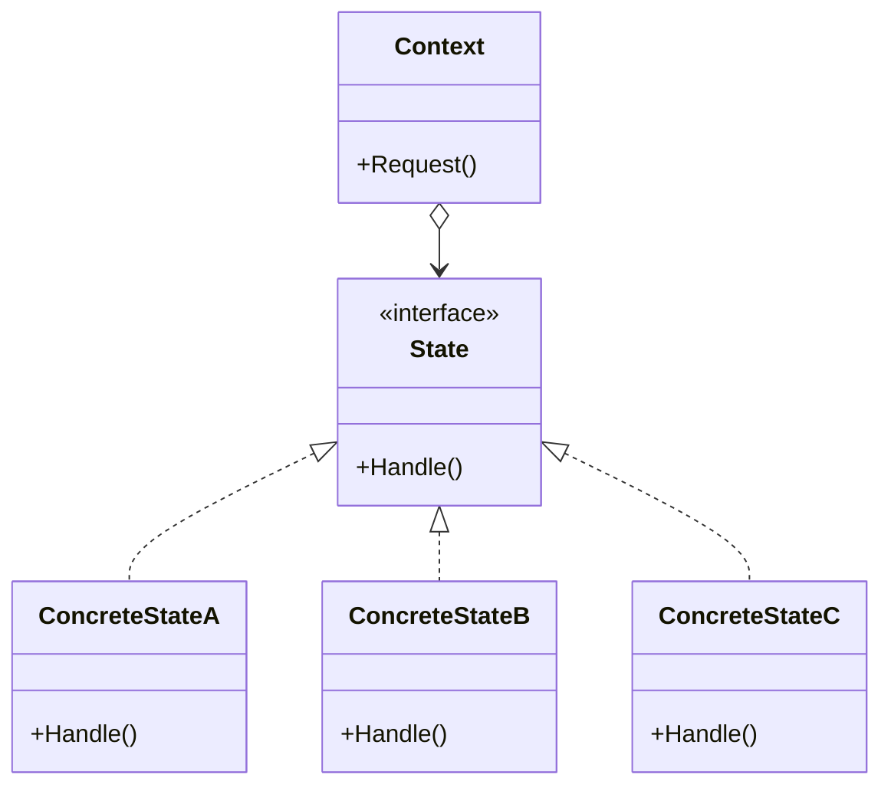

# 状态模式

```mermaid
classDiagram
    State <|.. ConcreteStateA
    State <|.. ConcreteStateB
    State <|.. ConcreteStateC
    Context o--> State
    class State{
        <<interface>>
        +Handle()
    }
    class ConcreteStateA{
        +Handle()
    }
    class ConcreteStateB{
        +Handle()
    }
    class ConcreteStateC{
        +Handle()
    }
    class Context{
        +Request()
    }
```
