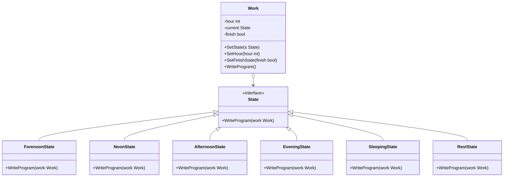

# 状态模式

```mermaid
classDiagram
    State <|-- ForenoonState
    State <|-- NoonState
    State <|-- AfternoonState
    State <|-- EveningState
    State <|-- SleepingState
    State <|-- RestState
    Work o--> State
    class State{
        <<interface>>
        +WriteProgram(work Work)
    }
    class ForenoonState{
        +WriteProgram(work Work)
    }
    class NoonState{
        +WriteProgram(work Work)
    }
    class AfternoonState{
        +WriteProgram(work Work)
    }
    class EveningState{
        +WriteProgram(work Work)
    }
    class SleepingState{
        +WriteProgram(work Work)
    }
    class RestState{
        +WriteProgram(work Work)
    }
    class Work{
        -hour    int
        -current State
        -finish  bool
        +SetState(s State)
        +SetHour(hour int)
        +SetFinishState(finish bool)
        +WriteProgram()
    }
```
