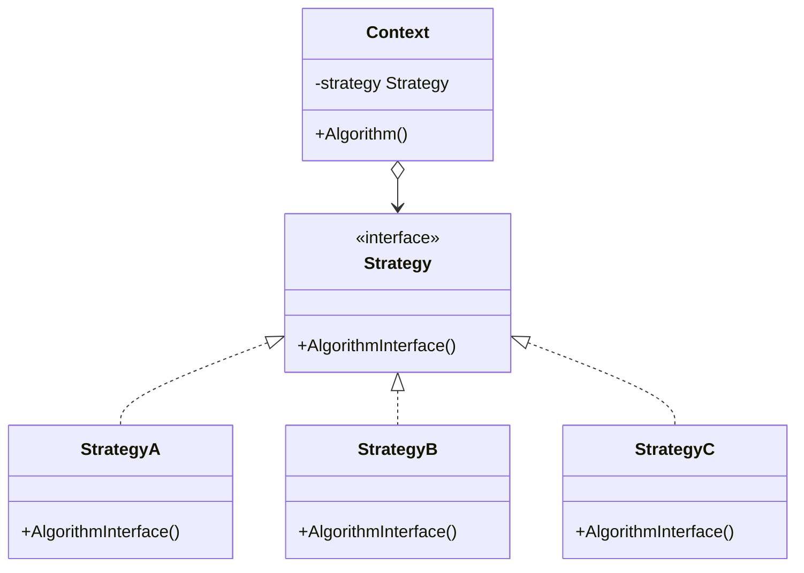

# 策略模式

```mermaid
classDiagram
    Strategy <|.. StrategyA
    Strategy <|.. StrategyB
    Strategy <|.. StrategyC
    Context o--> Strategy
    class Strategy{
        <<interface>>
        +AlgorithmInterface()
    }
    class StrategyA{
        +AlgorithmInterface()
    }
    class StrategyB{
        +AlgorithmInterface()
    }
    class StrategyC{
        +AlgorithmInterface()
    }
    class Context{
        -strategy Strategy
        +Algorithm()
    }
```
