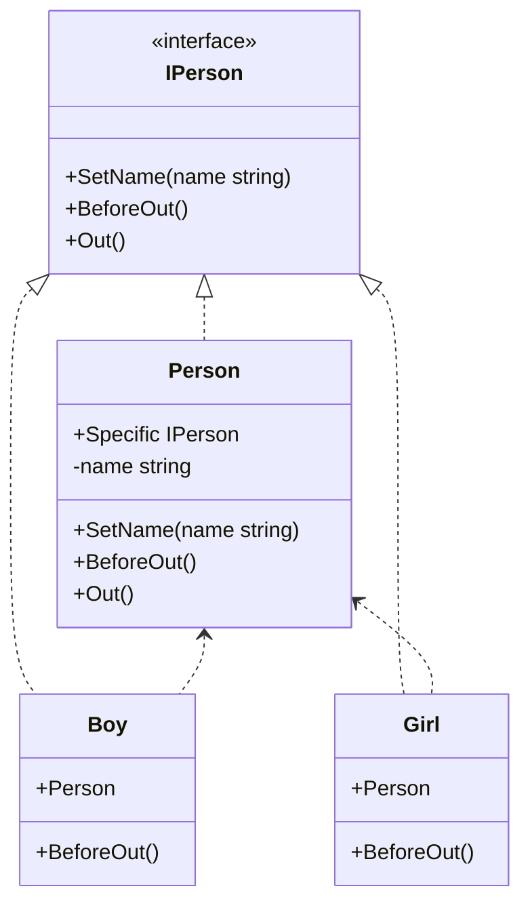

# 模板方法模式

```mermaid
classDiagram
    IPerson <|.. Person
    IPerson <|.. Boy
    IPerson <|.. Girl
    Person <.. Boy
    Person <.. Girl
    class IPerson{
        <<interface>>
        +SetName(name string)
        +BeforeOut()
        +Out()
    }
    class Person{
        +Specific IPerson
        -name     string
        +SetName(name string)
        +BeforeOut()
        +Out()
    }
    class Boy{
        +Person
        +BeforeOut()
    }
    class Girl{
        +Person
        +BeforeOut()
    }
```
