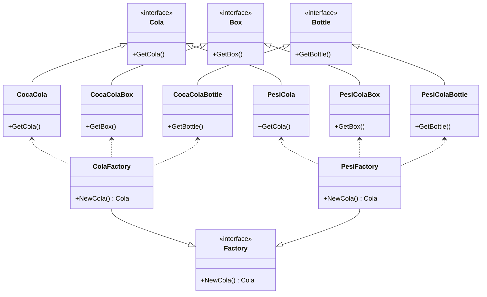

# 工厂模式

```mermaid
classDiagram
    Cola <|-- CocaCola
    Cola <|-- PesiCola
    Box <|-- CocaColaBox
    Box <|-- PesiColaBox
    Bottle <|-- CocaColaBottle
    Bottle <|-- PesiColaBottle
    PesiCola <.. PesiFactory
    PesiColaBox <.. PesiFactory
    PesiColaBottle <.. PesiFactory
    CocaCola <.. ColaFactory
    CocaColaBox <.. ColaFactory
    CocaColaBottle <.. ColaFactory
    ColaFactory --|> Factory
    PesiFactory --|> Factory
    class Cola{
        <<interface>>
        +GetCola()
    }
    class Box{
        <<interface>>
        +GetBox()
    }
    class Bottle{
        <<interface>>
        +GetBottle()
    }
    class CocaCola{
        +GetCola()
    }
    class CocaColaBox{
        +GetBox()
    }
    class CocaColaBottle{
        +GetBottle()
    }
    class PesiCola{
        +GetCola()
    }
    class PesiColaBox{
        +GetBox()
    }
    class PesiColaBottle{
        +GetBottle()
    }
    class Factory{
        <<interface>>
        +NewCola() Cola
    }
    class ColaFactory{
        +NewCola() Cola
    }
    class PesiFactory{
        +NewCola() Cola
    }
```
