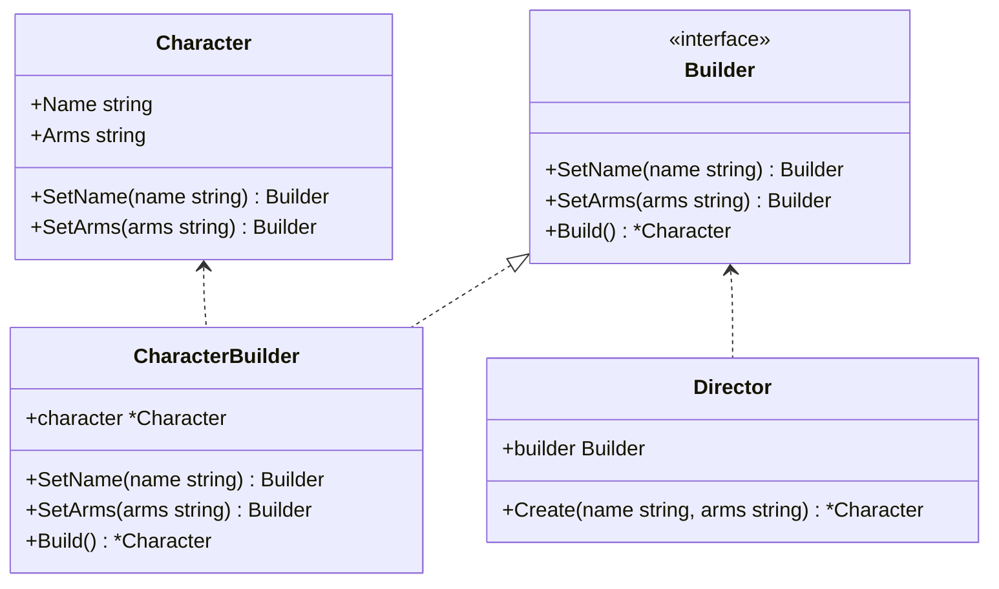

# 生成器模式（Builder Pattern）

```mermaid
classDiagram
    Builder <|.. CharacterBuilder
    Character <..CharacterBuilder
    Builder <..Director
    class Builder{
        <<interface>>
        +SetName(name string) Builder
        +SetArms(arms string) Builder
        +Build() *Character
    }
    class CharacterBuilder{
        +character *Character
        +SetName(name string) Builder
        +SetArms(arms string) Builder
        +Build() *Character
    }
    class Character{
        +Name string
        +Arms string
        +SetName(name string) Builder
        +SetArms(arms string) Builder
    }
    class Director{
        +builder Builder
        +Create(name string, arms string) *Character
    }
```
