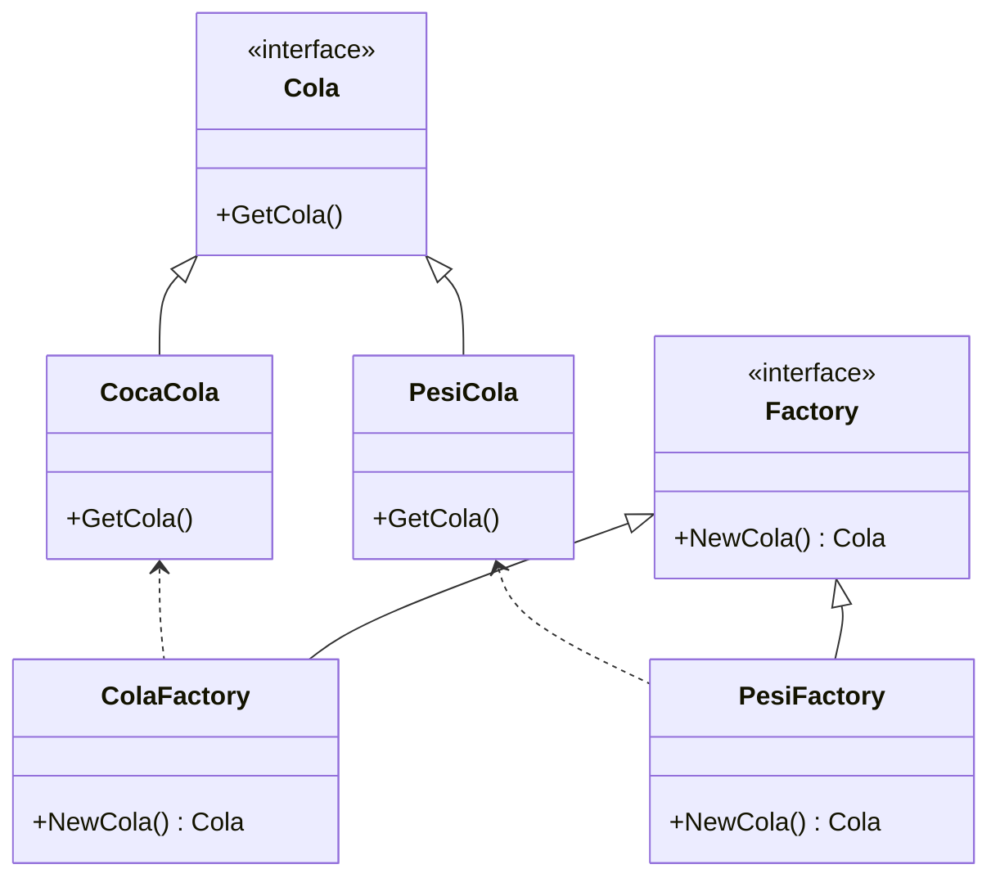

# 工厂模式

```mermaid
classDiagram
    Cola <|-- CocaCola
    Cola <|-- PesiCola
    PesiCola <.. PesiFactory
    CocaCola <.. ColaFactory
    Factory <|-- ColaFactory
    Factory <|-- PesiFactory
    class Cola{
        <<interface>>
        +GetCola()
    }
    class CocaCola{
        +GetCola()
    }
    class PesiCola{
        +GetCola()
    }
    class Factory{
        <<interface>>
        +NewCola() Cola
    }
    class ColaFactory{
        +NewCola() Cola
    }
    class PesiFactory{
        +NewCola() Cola
    }
```
