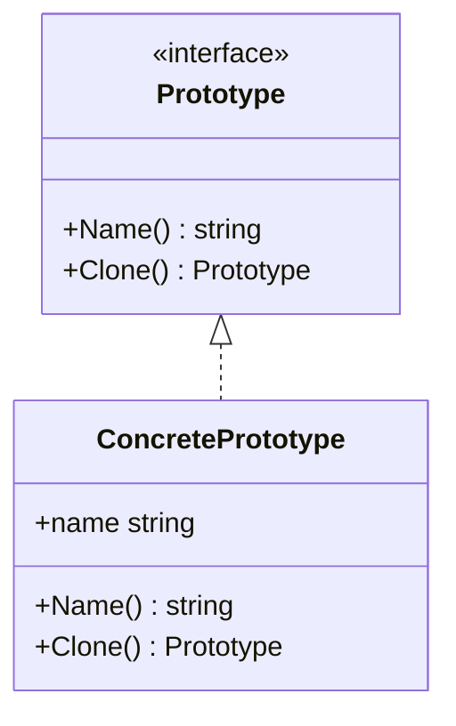

# 原型模式（Prototype Pattern）

```mermaid
classDiagram
    Prototype <|.. ConcretePrototype
    class Prototype{
        <<interface>>
        +Name() string
        +Clone() Prototype
    }
    class ConcretePrototype{
        +name string
        +Name() string
        +Clone() Prototype
    }
```
