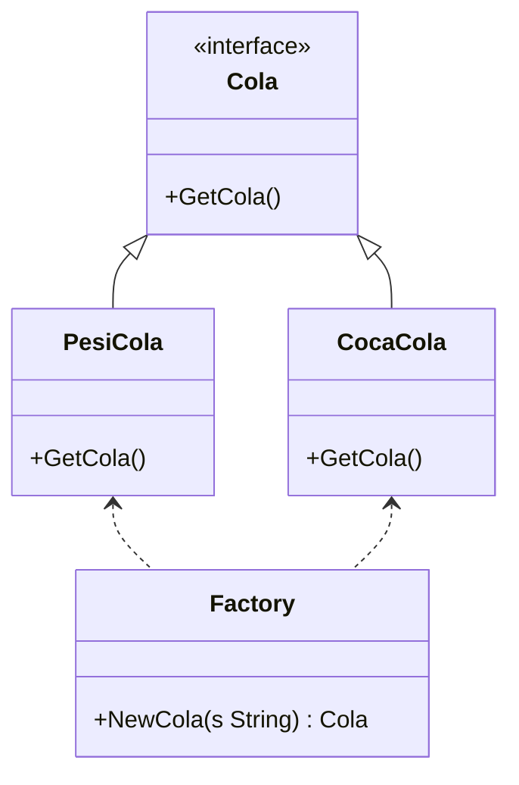

# 简单工厂模式

```mermaid
classDiagram
    Cola <|-- CocaCola
    Cola <|-- PesiCola
    PesiCola <.. Factory
    CocaCola <.. Factory
    class Cola{
        <<interface>>
        +GetCola()
    }
    class CocaCola{
        +GetCola()
    }
    class PesiCola{
        +GetCola()
    }
    class Factory{
        +NewCola(s String) Cola
    }
```
