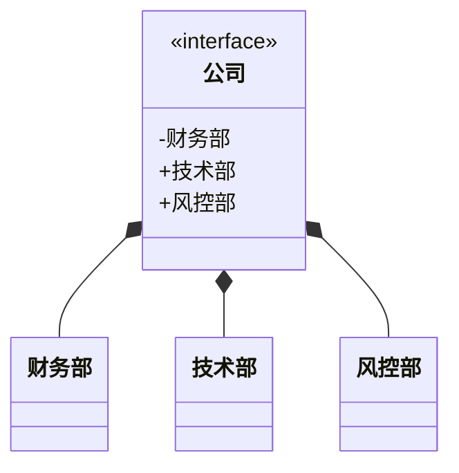

# 组合

与聚合关系一样，组合关系同样表示整体由部分构成的语义。比如公司由多个部门组成，但组合关系是一种强依赖的特殊聚合关系，如果整体不存在了，则部分也不存在了。例如，公司不存在了，部门也将不存在了。

```mermaid
classDiagram
    公司 *-- 财务部
    公司 *-- 技术部
    公司 *-- 风控部
    class 公司{
        <<interface>>
        -财务部
        +技术部
        +风控部
    }
```
