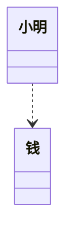

# 依赖

依赖关系是用一套带箭头的虚线表示的，如A依赖于B，他描述一个对象在运行期间会用到另一个对象的关系。

与关联关系不同的是，它是一种临时性的关系，通常在运行期间产生，并且随着运行时的变化，依赖关系也可能发生变化。显然，依赖也有方向，双向依赖是一种非常糟糕的结构，我们总是应该保持单向依赖，杜绝双向依赖的产生。

```mermaid
classDiagram
    小明 ..> 钱
```
