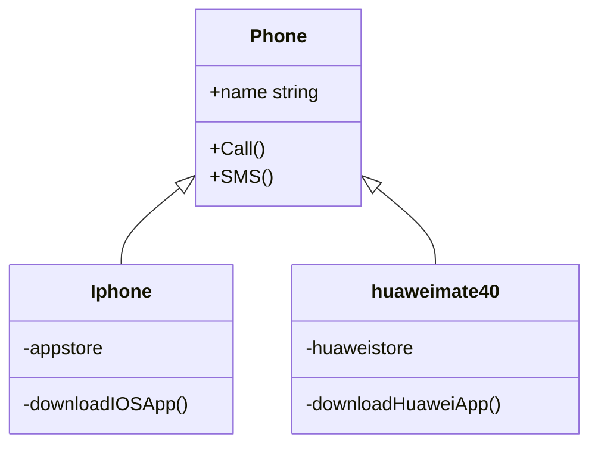

# 继承

继承用一条带空心箭头的直接表示。

```mermaid
classDiagram
    Phone <|-- Iphone
    Phone <|-- huaweimate40
    Phone : +name string
    Phone: +Call()
    Phone: +SMS()
    class Iphone{
        -appstore
        -downloadIOSApp()
    }
    class huaweimate40{
        -huaweistore
        -downloadHuaweiApp()
    }
```
