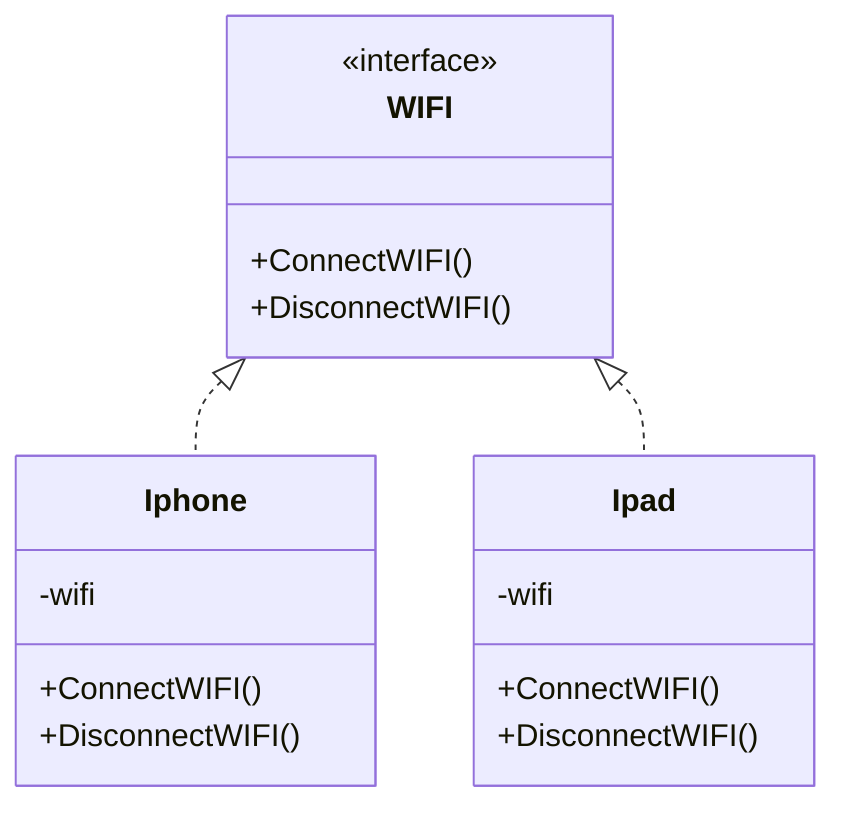

# 实现

实现关系用一条带空心箭头的虚线表示。

```mermaid
classDiagram
    WIFI <|.. Iphone
    WIFI <|.. Ipad
    class WIFI{
        <<interface>>
        +ConnectWIFI()
        +DisconnectWIFI()
    }
    class Iphone{
        -wifi
        +ConnectWIFI()
        +DisconnectWIFI()
    }
    class Ipad{
        -wifi
        +ConnectWIFI()
        +DisconnectWIFI()
    }
```
