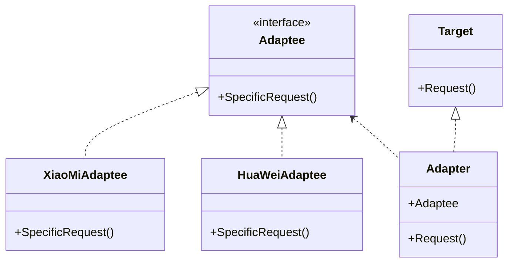

# 适配器模式

```mermaid
classDiagram
    Adaptee <|.. XiaoMiAdaptee
    Adaptee <|.. HuaWeiAdaptee
    Target <|..Adapter
    Adaptee <..Adapter
    class Adaptee {
        <<interface>>
        +SpecificRequest()
    }
    class XiaoMiAdaptee {
        +SpecificRequest()
    }
    class HuaWeiAdaptee {
        +SpecificRequest()
    }
    class Target {
        +Request()
    }
    class Adapter {
        +Adaptee
        +Request()
    }
```
