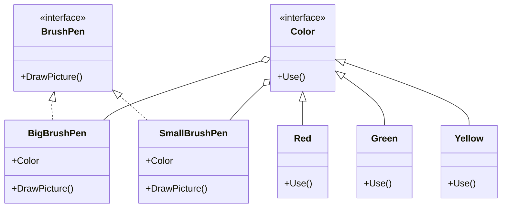

# 桥接模式

```mermaid
classDiagram
    BrushPen <|..BigBrushPen
    BrushPen <|..SmallBrushPen
    Color <|-- Red
    Color <|-- Green
    Color <|-- Yellow
    Color o-- BigBrushPen
    Color o-- SmallBrushPen
    class Color {
        <<interface>>
        +Use()
    }
    class Red {
        +Use()
    }
    class Green {
        +Use()
    }
    class Yellow {
        +Use()
    }
    class BrushPen {
        <<interface>>
        +DrawPicture()
    }
    class BigBrushPen{
        +Color
        +DrawPicture()
    }
    class SmallBrushPen{
        +Color
        +DrawPicture()
    }
```
