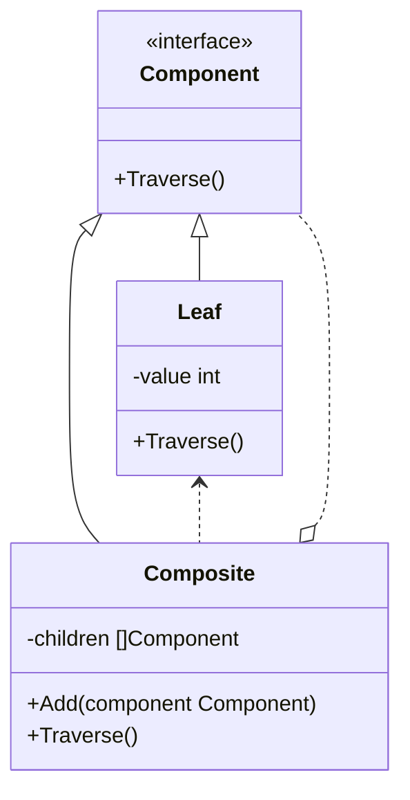

# 组合模式

```mermaid
classDiagram
    Component <|-- Leaf
    Component <|-- Composite
    Composite o.. Component
    Leaf <.. Composite

    class Component {
        <<interface>>
        +Traverse()
    }
    class Leaf {
        -value int
        +Traverse()
    }
    class Composite {
        -children []Component
        +Add(component Component)
        +Traverse()
    }
```
