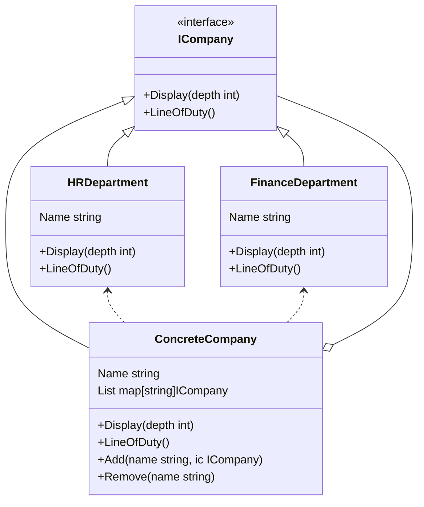

# 组合模式

```mermaid
classDiagram
    ICompany <|-- ConcreteCompany
    ICompany <|-- HRDepartment
    ICompany <|-- FinanceDepartment
    ConcreteCompany o-- ICompany
    HRDepartment <.. ConcreteCompany
    FinanceDepartment <.. ConcreteCompany
    class ICompany {
        <<interface>>
        +Display(depth int)
        +LineOfDuty()
    }
    class ConcreteCompany {
        Name string
        List map[string]ICompany
        +Display(depth int)
        +LineOfDuty()
        +Add(name string, ic ICompany)
        +Remove(name string)
    }
    class HRDepartment {
        Name string
        +Display(depth int)
        +LineOfDuty()
    }
    class FinanceDepartment {
        Name string
        +Display(depth int)
        +LineOfDuty()
    }
```
