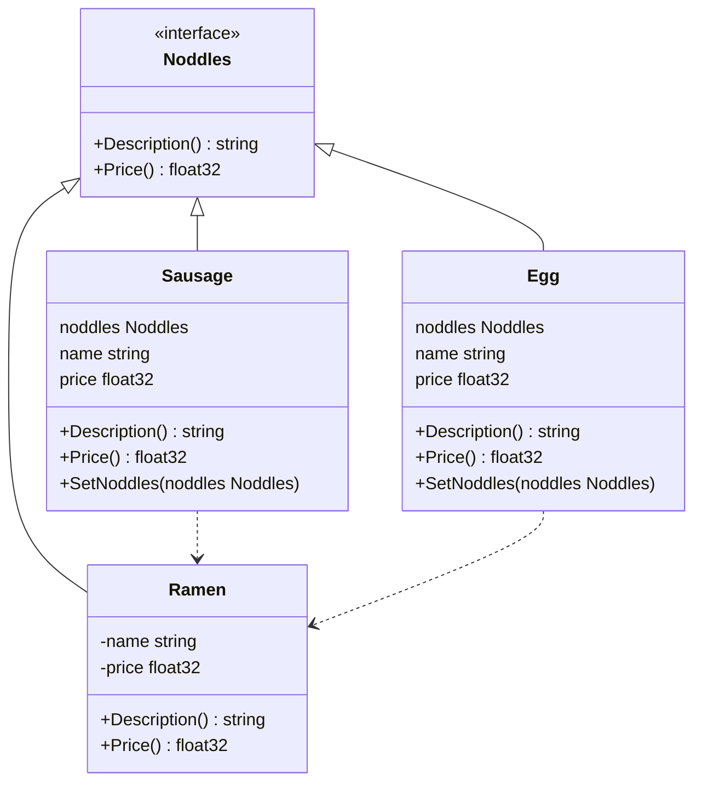

# 装饰模式

```mermaid
classDiagram
    Noddles <|-- Ramen
    Noddles <|-- Egg
    Noddles <|-- Sausage
    Sausage ..> Ramen
    Egg ..> Ramen
    class Noddles{
        <<interface>>
        +Description() string
        +Price() float32
    }
    class Ramen {
        -name  string
        -price float32
        +Description() string
        +Price() float32
    }
    class Egg{
        noddles Noddles
        name    string
        price   float32
        +Description() string
        +Price() float32
        +SetNoddles(noddles Noddles)
    }
    class Sausage {
        noddles Noddles
        name    string
        price   float32
        +Description() string
        +Price() float32
        +SetNoddles(noddles Noddles)
    }
```

