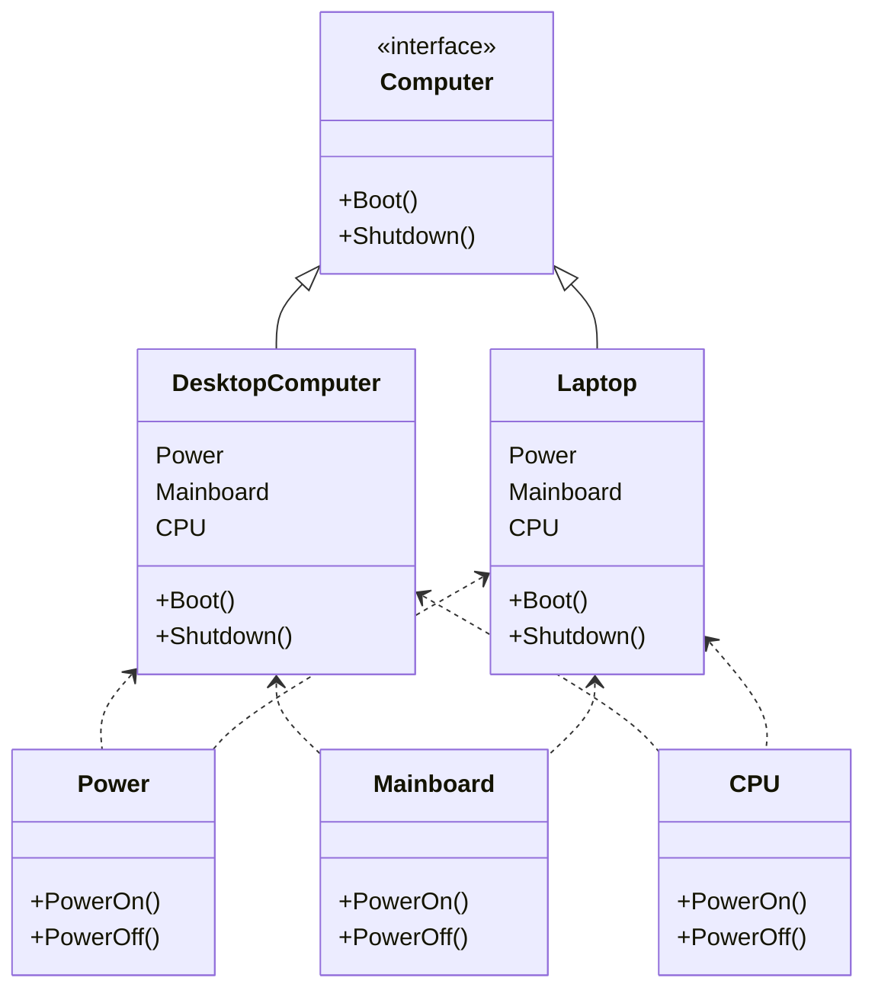

# 外观模式

```mermaid
classDiagram
    Computer <|-- DesktopComputer
    Computer <|-- Laptop
    DesktopComputer <..Power
    DesktopComputer <..Mainboard
    DesktopComputer <..CPU
    Laptop <..Power
    Laptop <..Mainboard
    Laptop <..CPU
    class Computer{
        <<interface>>
        +Boot()
        +Shutdown()
    }
    class DesktopComputer {
        Power
        Mainboard
        CPU
        +Boot()
        +Shutdown()
    }
    class Laptop {
        Power
        Mainboard
        CPU
        +Boot()
        +Shutdown()
    }
    class Power{
        +PowerOn()
        +PowerOff()
    }
    class Mainboard{
        +PowerOn()
        +PowerOff()
    }
    class CPU {
        +PowerOn()
        +PowerOff()
    }
```

