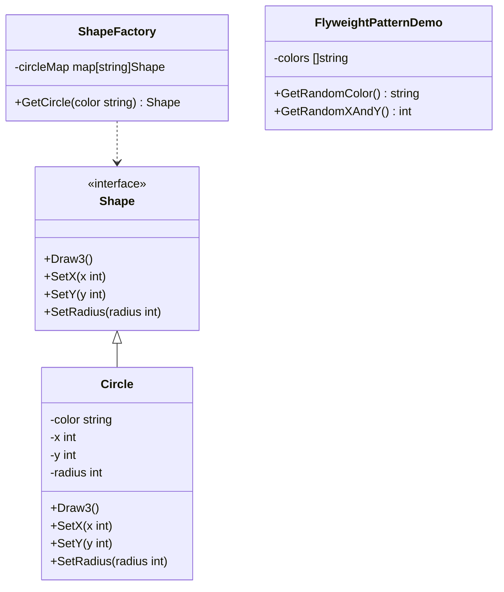

# 享元模式

```mermaid
classDiagram
    Shape <|-- Circle
    ShapeFactory ..> Shape
    class Shape{
        <<interface>>
        +Draw3()
        +SetX(x int)
        +SetY(y int)
        +SetRadius(radius int)
    }
    class Circle{
        -color  string
        -x      int
        -y      int
        -radius int
        +Draw3()
        +SetX(x int)
        +SetY(y int)
        +SetRadius(radius int)
    }
    class ShapeFactory{
        -circleMap map[string]Shape
        +GetCircle(color string) Shape
    }
    class FlyweightPatternDemo{
        -colors []string
        +GetRandomColor() string
        +GetRandomXAndY() int
    }
```
