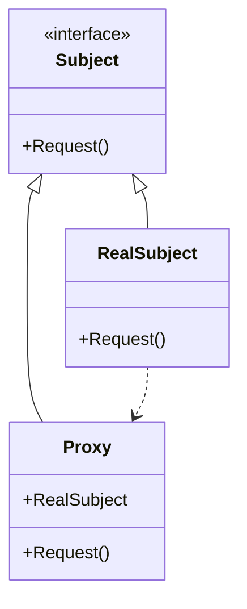

# 代理模式

```mermaid
classDiagram
    Subject <|-- RealSubject
    Subject <|-- Proxy
    RealSubject ..> Proxy
    class Subject{
        <<interface>>
        +Request()
    }
    class RealSubject{
        +Request()
    }
    class Proxy{
        +RealSubject
        +Request()
}
```
