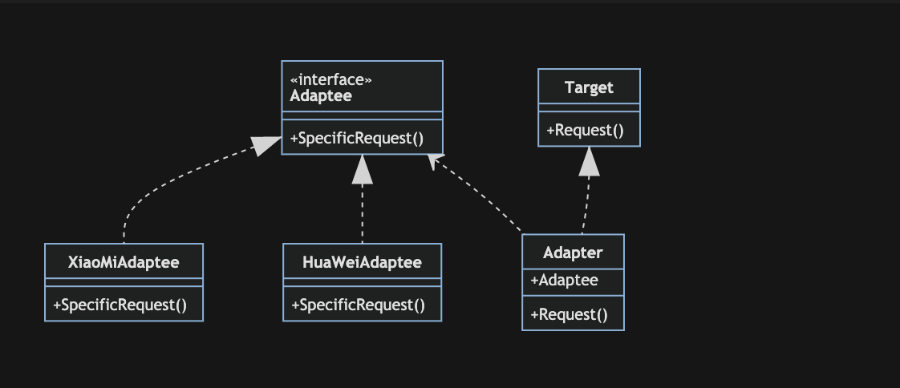

# 适配器模式

适配器模式(Adapter Pattern) ：将一个接口转换成客户希望的另一个接口，使得原本由于接口不兼容而不能一起工作的那些类可以一起工作。适配器模式的别名是包装器模式（Wrapper），是一种结构型设计模式

适配器模式一般包含3个角色：

- Target(目标接口角色): 定义了客户所需要的接口
- Adapter(适配器角色): 实现了Target接口，并且还能调用另一个接口，起到适配的作用
- Adaptee(被适配角色): 即被适配的角色，定义了一个已经存在的接口

## 举例

在现实生活中，我们的笔记本电脑的工作电压大多数都是20V，而我国的家庭用电是220V，如何让20V的笔记本电脑能够工作在220V的电压下工作？答案：引入一个电源适配器，俗称变压器，有了这个电源适配器，生活用电和笔记本电脑即可兼容。

软件开发的过程中，有时候也会存在这种不兼容的情况，我们也可以像引入一个称之为适配器的角色来协调这些存在不兼容的结构，即我们下面要讲的设配器模式

## 优点

- 符合开闭原则：使用适配器而不需要改变现有类，提高类的复用性。
- 目标类和适配器类解耦，提高程序扩展性。

## 缺点

- 增加了系统的复杂性
