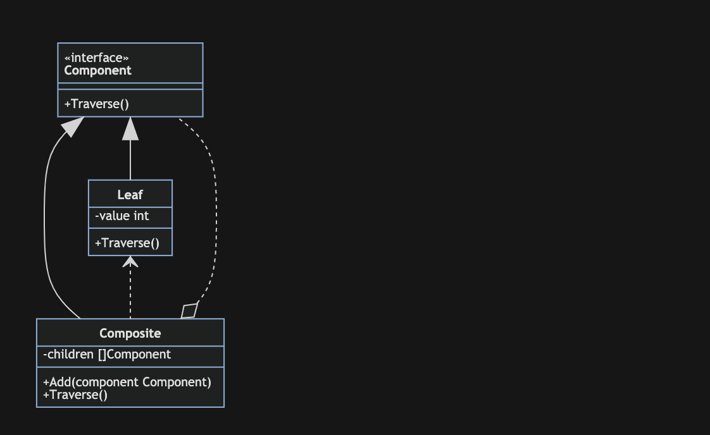
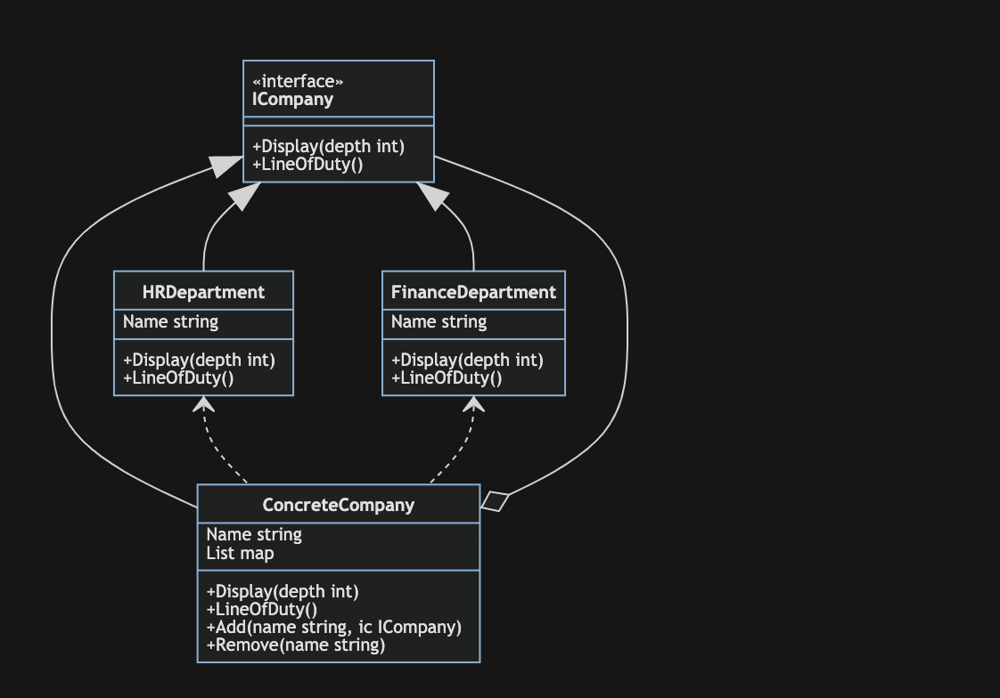

# 组合模式

组合模式(Composite):将对象组合成树形结构以以表示‘部分-整体’的层次结构。组合模式使得用户对单个对象和组合对象的使用具有一致性。

组合模式包含三个角色：

- Component:是组合中的对象声明接口，在适当的情况下，实现所有类共有接口的默认行为。声明一个接口用于访问和管理Component
- Leaf:在组合中表示叶子节点对象，叶子节点没有子节点
- Composite:定义有枝接节点行为，用来存储子部件，在Composite接口中实现与子部件有关操作

例如，大型公司就是一个典型的组合模式应用的例子，大型公司有总部，还在每个区设置有分部，有可能还在每个城市都设有办事处，而且每个分部或者办事处都具有和总部一样的公司架构。我们下面就以这个为模型实现golang的组合模式。

