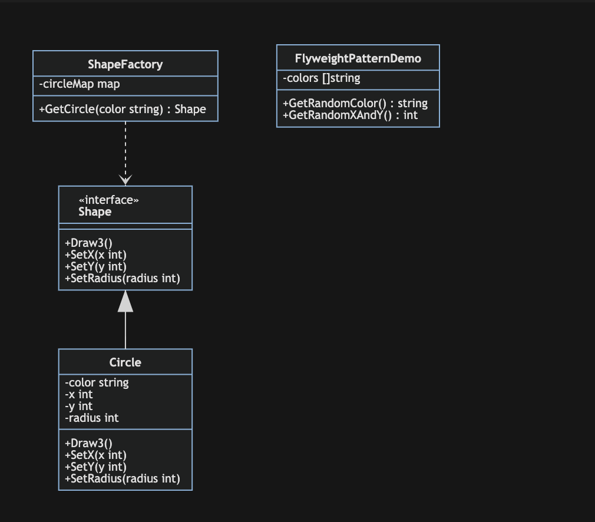

# 享元模式

享元模式(Flyweight Pattern)：运用共享技术复用大量细粒度的对象,降低程序内存的占用,提高程序的性能.

享元模式(Flyweight)，运用共享技术有效地支持大量细粒度对象。系统只使用少量对象，而这些对象都很相似，状态变化很小，可以实现对象地多次复用。由于享元模式要求能够共享地对象必须是细粒度对象，因此又称为轻量级模式，是一种结构型模式

定义如果不是很好理解地话，读者可以对照下面围棋地例子细细品味：

围棋棋盘中包含大量的黑子和白子，它们形状、大小都一模一样，只是出现的位置不同而已。

享元模式包含四个角色：

- Flyweight(抽象享元类)：一个接口或抽象类，声明了具体享元类的公共方法。
- ConcreteFlyweight(具体享元类): 实现了抽象享元类，其实例称为享元对象。
- UnsharedConcreteFlyweight(非共享具体享元类): 并不是所有的抽象享元类的子类都需要被共享，不能被共享的子类可设计为非共享具体享元类。
- FlyweightFactory(享元工厂类): 用于创建并管理享元对象，一般设计为一个Key-Value键值对的集合(可以结合工厂模式设计)。其作用就在于：提供一个用于存储享元对象的享元池，当用户需要对象时，首先从享元池中获取，如果享元池中不存在，那么就创建一个新的享元对象返回给用户，并在享元池中保存该新增对象。

## 举例

例如 `UITableViewCell` 的缓存机制，达到降低内存消耗的目的。举例，音乐服务根据收费划分出免费用户和会员用户，免费用户只能听部分免费音乐，会员用户可以听全部的音乐，并且可以下载。虽然权限上二者间有一些区别，但是他们所享受的音乐来是自于同一个音乐库，这样所有的音乐都只需要保存一份就可以了。另外如果出现音乐库里没有的音乐时，则需要新增该音乐，然后其他服务也可以享受新增的音乐，相当于享元池或缓存池的功能。

享元模式区保证共享内部状态如音乐库，而外部状态根据不同需求定制如各种访问权限，使用中不能去改变内部状态，以达到共享的目的。

## 优点

- 使用享元模可以减少内存中对象的数量，使得相同对象或相似对象在内存中只保存一份，降低系统的使用内存，也可以提性能。
- 享元模式的外部状态相对独立，而且不会影响其内部状态，从而使得享元对象可以在不同的环境中被共享。

## 缺点

- 使用享元模式需要分离出内部状态和外部状态，这使得程序的逻辑复杂化。
- 对象在缓冲池中的复用需要考虑线程问题。
