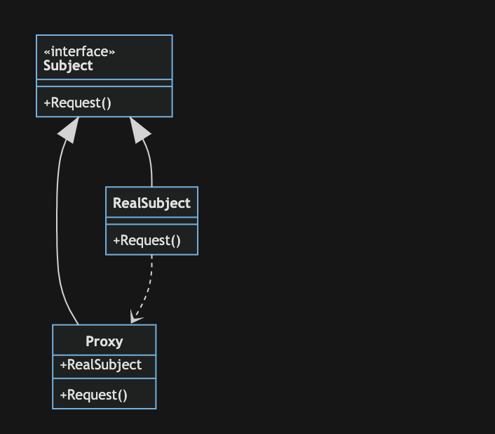

# 代理模式

> 代理模式(Proxy Pattern) ：为某个对象提供一个代理，并由这个代理对象控制对原对象的访问

代理模式主要包含以下三个角色：

- Subject(抽象主题角色)：定义了Proxy和RealSubject的共用接口，这样就在任何使用RealSubject的地方都可以使用Proxy
- RealSubject(真实主题角色)：定义了Proxy所代表的真实实体
- Proxy(代理主题角色)：保存一个Subject的引用使得代理可以访问实体，并提供一个于Subject的接口相同的接口，这样代理就可以用来替代实体

## 举例

代理模式像一个房屋中介，买家只能通过中介来买房，代理具备被代理类的所有功能，就像房东有卖房功能，中介也具有卖房功能。此外代理实例还可以帮助被代理实例进行一些额外处理，比如中介可以帮助房东筛选优质买家的功能，帮助房东pass掉一些不符合条件的买家。还有消息队列也是该模式。

## 优点

降低系统的耦合度：代理模式能够协调调用者和被调用者，在一定程度上降低了系统的耦合度。

不同类型的代理可以对客户端对目标对象的访问进行不同的控制：

- 远程代理,使得客户端可以访问在远程机器上的对象，远程机器可能具有更好的计算性能与处理速度，可以快速响应并处理客户端请求。
- 虚拟代理通过使用一个小对象来代表一个大对象，可以减少系统资源的消耗，对系统进行优化并提高运行速度。
- 保护代理可以控制客户端对真实对象的使用权限。

## 缺点

由于在客户端和被代理对象之间增加了代理对象，因此可能会让客户端请求的速度变慢。
